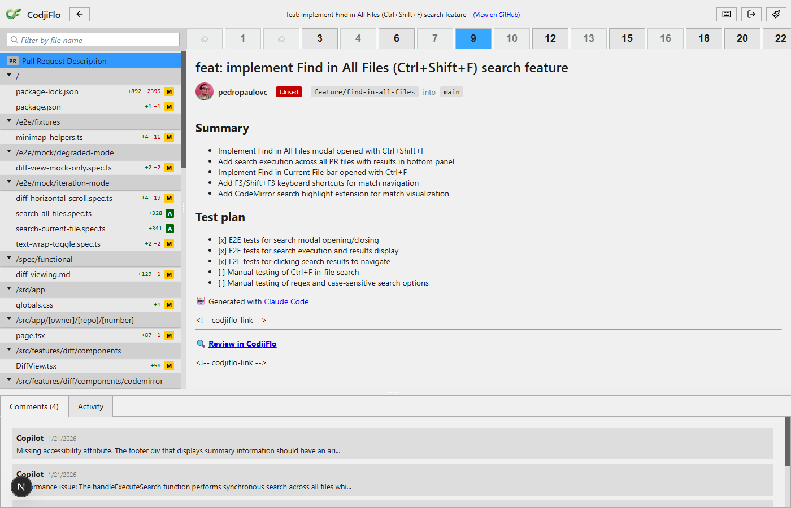
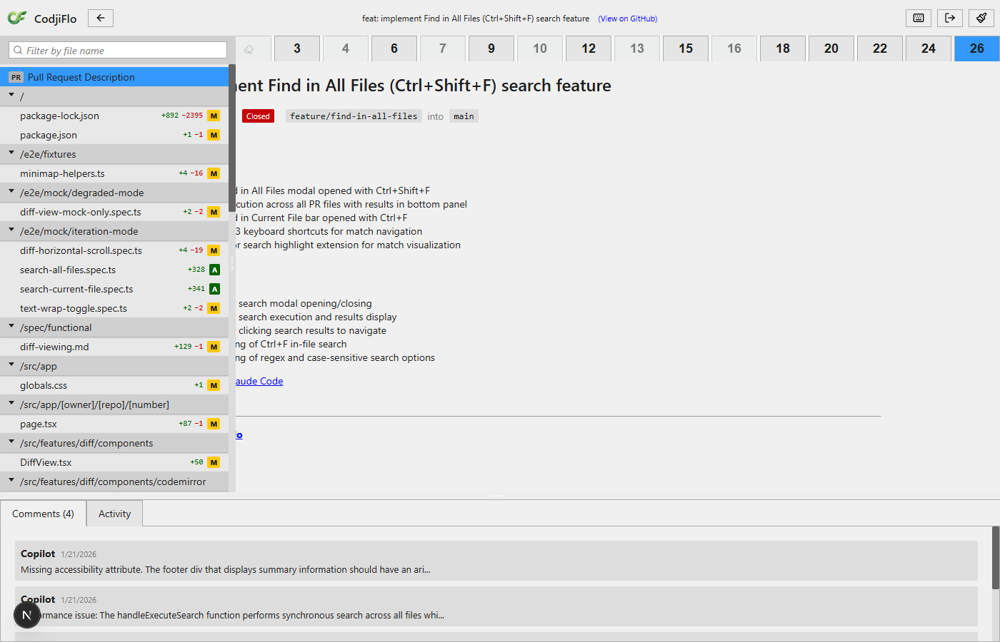
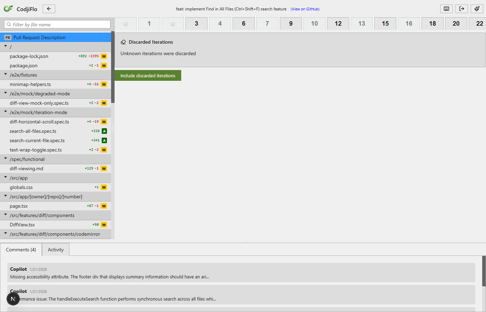
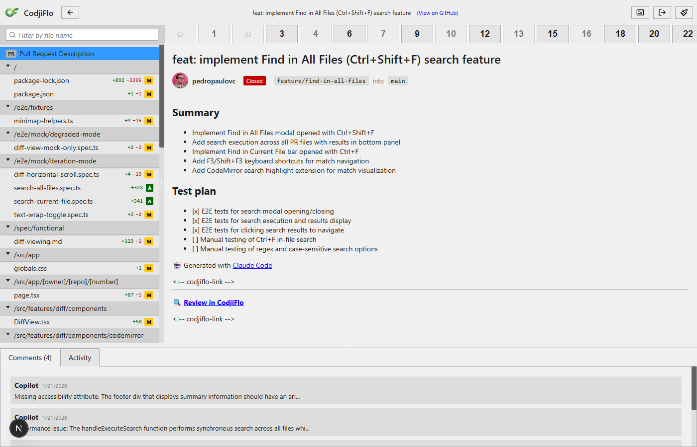

# S-4.2.2: Collapsed Iterations UI -- Demo

**Feature**: Collapsed iteration groups in the iteration selector for stateless mode.

**PR under review**: [pedropaulovc/codjiflo#292](https://github.com/pedropaulovc/codjiflo/pull/292) -- "feat: implement Find in All Files (Ctrl+Shift+F) search feature"

**Mode**: Stateless mode forced via `?mode=stateless` query param. This PR has 4 force-push events in its timeline, producing 3 collapsed groups (one with GC'd commits showing "Unknown iterations discarded", and two with discoverable discarded commits).

---

## Step 1: Default Iteration Selector

The iteration selector renders in stateless mode with 26 total iterations. Three collapsed group tabs appear as grayed-out eraser icons alongside the live iteration tabs (3, 6, 9, 12, 15, 18, 20, 22, 24, 26). The collapsed tabs are visually distinct -- smaller, grayed out, with the lucide Eraser icon instead of a number.

**Covers**: AC-4.2.2.1 (collapsed group renders as single tab with Eraser icon, grayed out), AC-4.2.2.7 (collapsed tabs skipped in default range selection).

---

## Step 2: Collapsed Tab Hover

Hovering over the second collapsed tab shows the cursor changes to pointer, indicating it is interactive. The accessible label reads "6 iterations discarded", which serves as the tooltip content (AC-4.2.2.2).

**Covers**: AC-4.2.2.2 (hover tooltip shows "N iterations discarded").

---

## Step 3: History View Open

Clicking the "6 iterations discarded" collapsed tab replaces the diff area with a history view listing all 6 discarded commits. Each entry shows:
- Revision number (#1, #4, #7, #10, #13, #16)
- Full commit message (e.g., "feat: implement Find in All Files (Ctrl+Shift+F) search feature")
- Author (pedropaulovc)
- Timestamp (e.g., 2026-01-22T02:01:43Z)

The "Include discarded iterations" button is visible at the bottom.

**Covers**: AC-4.2.2.3 (click replaces diff area with history view), AC-4.2.2.4 (history view has "Include discarded iterations" button).

---

## Step 4: Expanded Individual Tabs

After clicking "Include discarded iterations", the collapsed group tab is replaced by individual discarded iteration tabs (1, 4, 7, 10, 13, 16) shown at reduced opacity alongside the live tabs (3, 6, 9, 12, 15, 18, 20, 22, 24, 26) at full opacity. The discarded tabs are clearly visually distinguished from live tabs by their lower opacity.

**Covers**: AC-4.2.2.5 (expanded group shows individual grayed-out tabs).

---

## Step 5: Range Selection Cross-Boundary

Selecting discarded tab 4 and then shift-clicking live tab 9 creates a cross-boundary range. The range includes both discarded iterations (4, 7) and live iterations (3, 6, 9), demonstrating that expanded collapsed iterations participate in iteration range diffs. Tabs in the range are highlighted.

**Covers**: AC-4.2.2.6 (expanded collapsed iterations can participate in iteration range diffs).

---

## Step 6: Back to Normal Selection

Clicking iteration 26 returns to normal single-selection mode. The iteration selector shows all tabs (both discarded at reduced opacity and live at full opacity) with only iteration 26 selected (blue highlight). The PR description content is displayed in the main area.

---

## Step 7: Unknown Iterations (GC'd SHA)

The first collapsed group represents a force-push whose discarded commits were garbage-collected by GitHub (Compare API returned 404). The history view shows "Unknown iterations were discarded" instead of individual commit details. The "Include discarded iterations" button is still available.

**Covers**: AC-4.2.2.8 (GC'd commits shown as unavailable within expanded view), AC-4.2.2.9 (Compare API fails -- show "Unknown iterations discarded").

---

## Step 8: Unknown Count Dismissed

After clicking "Include" on the unknown-count group, the history view is dismissed and the collapsed eraser tab remains in the iteration selector (since there are no individual iterations to expand for GC'd commits). The UI returns to showing the PR description.

---

## Acceptance Criteria Coverage

| AC | Description | Screenshot |
|----|-------------|------------|
| AC-4.2.2.1 | Collapsed group renders as single tab with Eraser icon, grayed out | #1 |
| AC-4.2.2.2 | Hover tooltip shows "N iterations discarded" | #2 |
| AC-4.2.2.3 | Click replaces diff area with history view | #3 |
| AC-4.2.2.4 | History view has "Include discarded iterations" button | #3 |
| AC-4.2.2.5 | Expanded group shows individual grayed-out tabs | #4 |
| AC-4.2.2.6 | Expanded collapsed iterations participate in range diffs | #5 |
| AC-4.2.2.7 | Collapsed tabs skipped in range selection by default | #1 |
| AC-4.2.2.8 | GC'd commits shown as unavailable | #7 |
| AC-4.2.2.9 | Compare API fails -- "Unknown iterations discarded" | #7 |

## Observations

- **Real data**: This demo uses real GitHub data from PR #292 in the CodjiFlo repo, with actual force-push events from the PR's development history.
- **GC'd commits**: The first force-push event had its before-SHA garbage-collected by GitHub, naturally demonstrating the "Unknown iterations discarded" flow without any mocking.
- **Stateless mode**: The `?mode=stateless` query param successfully bypasses artifact loading, forcing the app to use the Timeline API for iteration discovery.
- **Visual clarity**: Discarded tabs are clearly distinguishable from live tabs via reduced opacity. The eraser icon is an effective visual indicator for collapsed groups.
