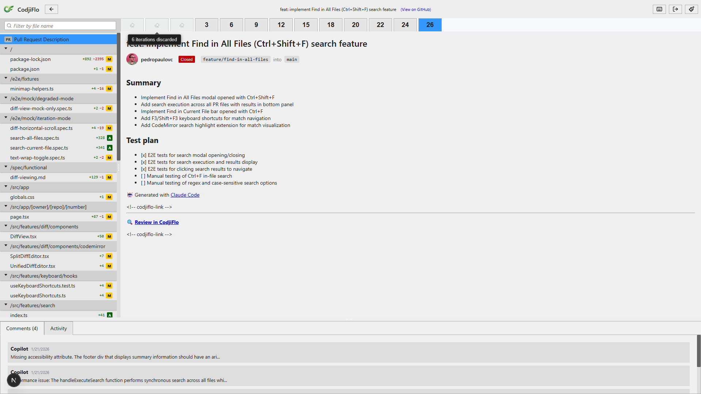
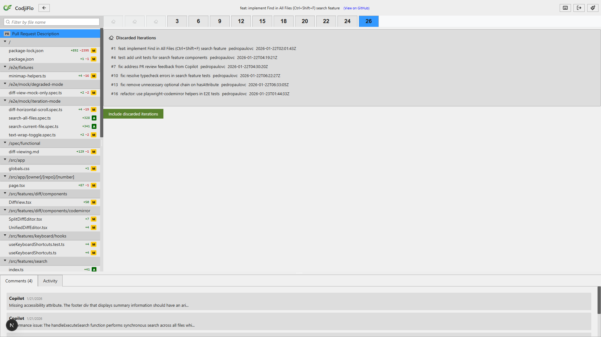
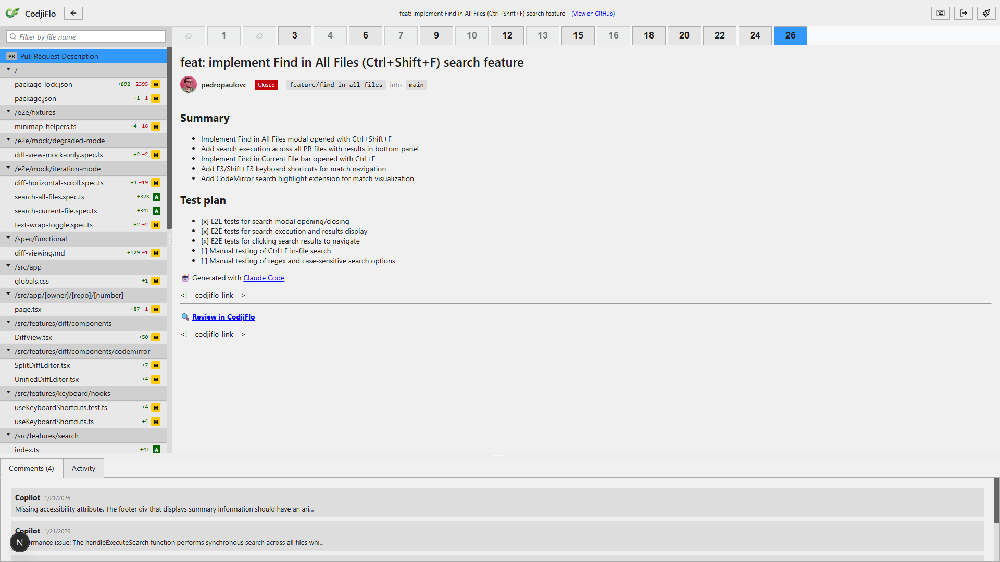
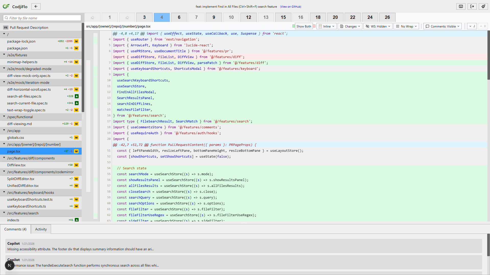
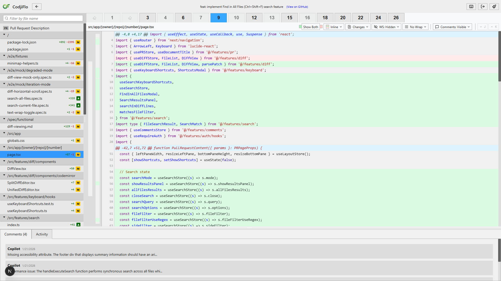
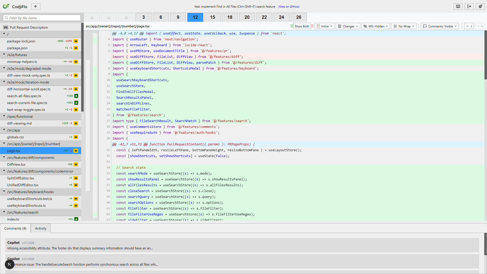
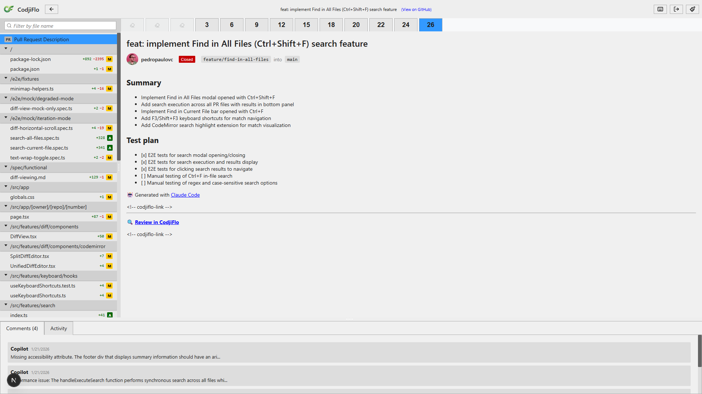
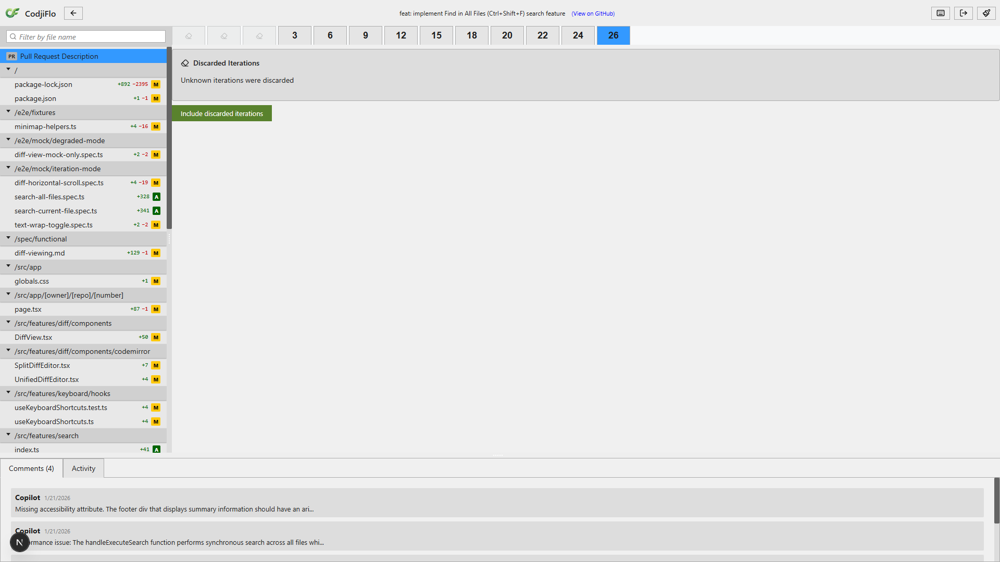

# S-4.2.2: Collapsed Iterations UI -- Demo

**Feature**: Collapsed iteration groups in the iteration selector for stateless mode.

**PR under review**: [pedropaulovc/codjiflo#292](https://github.com/pedropaulovc/codjiflo/pull/292) -- "feat: implement Find in All Files (Ctrl+Shift+F) search feature"

**Mode**: Stateless mode forced via `?mode=stateless` query param. This PR has 4 force-push events in its timeline, producing 3 collapsed groups (one with GC'd commits showing "Unknown iterations discarded", and two with discoverable discarded commits).

---

## Step 1: Default Iteration Selector

The iteration selector renders in stateless mode with 26 total iterations. Three collapsed group tabs appear as grayed-out eraser icons alongside the live iteration tabs (3, 6, 9, 12, 15, 18, 20, 22, 24, 26). The collapsed tabs are visually distinct -- smaller, grayed out, with the lucide Eraser icon instead of a number. Tab 26 is highlighted in blue as the currently selected iteration.

**Covers**: AC-4.2.2.1 (collapsed group renders as single tab with Eraser icon, grayed out).

---

## Step 2: Collapsed Tab Hover

Hovering over the second collapsed tab reveals the tooltip "6 iterations discarded". The tooltip is rendered as an overlay below the tab (native `title` attribute verified via `getAttribute`). The tooltip text communicates exactly how many iterations were lost in this force-push event.

**Covers**: AC-4.2.2.2 (hover tooltip shows "N iterations discarded").

---

## Step 3: History View Open

Clicking the "6 iterations discarded" collapsed tab replaces the diff area with a history view listing all 6 discarded commits. Each entry shows:
- Revision number (#1, #4, #7, #10, #13, #16)
- Full commit message (e.g., "feat: implement Find in All Files (Ctrl+Shift+F) search feature")
- Author (pedropaulovc)
- Timestamp (e.g., 2026-01-22T02:01:43Z)

The green "Include discarded iterations" button is visible at the bottom.

**Covers**: AC-4.2.2.3 (click replaces diff area with history view), AC-4.2.2.4 (history view has "Include discarded iterations" button).

---

## Step 4: Expanded Individual Tabs

After clicking "Include discarded iterations", the collapsed group tab is replaced by individual discarded iteration tabs (1, 4, 7, 10, 13, 16) shown at reduced opacity alongside the live tabs (3, 6, 9, 12, 15, 18, 20, 22, 24, 26) at full opacity. The discarded tabs are clearly visually distinguished from live tabs by their lower opacity. The "Unknown" and "10 iterations discarded" collapsed groups remain as eraser icons.

**Covers**: AC-4.2.2.5 (expanded group shows individual grayed-out tabs).

---

## Step 5: Discarded Iteration Diff

Clicking discarded iteration tab 4 selects the range 1-4 and shows the actual code diff for `page.tsx` during that iteration range. The diff shows real code changes -- import additions for the search feature, new state hooks -- proving the core user value of reviewing force-pushed (discarded) code. Green lines indicate additions, red lines indicate deletions.

**Covers**: Demonstrates that discarded iterations contain reviewable code diffs, not just metadata.

---

## Step 6: Range Selection Cross-Boundary

Shift-clicking from discarded tab 4 to live tab 9 creates a cross-boundary range. The range includes both discarded iterations (4, 7) and live iterations (3, 6, 9), all highlighted in the toolbar. The diff content area shows the actual code diff across this mixed range, demonstrating that expanded collapsed iterations participate fully in iteration range diffs.

**Covers**: AC-4.2.2.6 (expanded collapsed iterations can participate in iteration range diffs).

---

## Step 7: Collapsed Tabs Skipped in Default Range Selection

After reloading to the default view (collapsed groups not expanded), selecting a range from iteration 3 to iteration 12 highlights only the live tabs (3, 6, 9, 12). The three collapsed eraser icons at the left of the toolbar are NOT included in the range -- they are visually and functionally excluded from default range selection. The diff content area shows actual code for this live-only range.

**Covers**: AC-4.2.2.7 (collapsed tabs skipped in default range selection).

---

## Step 8: Back to Normal Selection

Clicking iteration 26 returns to the full PR view. All live iteration tabs (3 through 26) are shown in the toolbar with tab 26 highlighted in blue. The collapsed eraser icons remain visible but unselected. The PR description content is displayed in the main area.

---

## Step 9: Unknown Iterations (GC'd SHA)

The first collapsed group represents a force-push whose discarded commits were garbage-collected by GitHub (Compare API returned 404). Clicking this tab shows the history view with "Unknown iterations were discarded" instead of individual commit details. The green "Include discarded iterations" button is still available.

**Covers**: AC-4.2.2.8 (GC'd commits shown as unavailable within expanded view), AC-4.2.2.9 (Compare API fails -- show "Unknown iterations discarded").

---

## Step 10: Unknown Count Dismissed

After clicking "Include" on the unknown-count group, the history view is dismissed and the collapsed eraser tab remains in the iteration selector (since there are no individual iterations to expand for GC'd commits). The UI returns to showing the PR description. This is the correct behavior -- GC'd commits cannot be expanded into individual tabs because their content is no longer available on GitHub.

---

## Acceptance Criteria Coverage

| AC | Description | Screenshot |
|----|-------------|------------|
| AC-4.2.2.1 | Collapsed group renders as single tab with Eraser icon, grayed out | #1 |
| AC-4.2.2.2 | Hover tooltip shows "N iterations discarded" | #2 |
| AC-4.2.2.3 | Click replaces diff area with history view | #3 |
| AC-4.2.2.4 | History view has "Include discarded iterations" button | #3 |
| AC-4.2.2.5 | Expanded group shows individual grayed-out tabs | #4 |
| AC-4.2.2.6 | Expanded collapsed iterations participate in range diffs | #5, #6 |
| AC-4.2.2.7 | Collapsed tabs skipped in range selection by default | #7 |
| AC-4.2.2.8 | GC'd commits shown as unavailable | #9 |
| AC-4.2.2.9 | Compare API fails -- "Unknown iterations discarded" | #9 |

## Observations

- **Real data**: This demo uses real GitHub data from PR #292 in the CodjiFlo repo, with actual force-push events from the PR's development history.
- **GC'd commits**: The first force-push event had its before-SHA garbage-collected by GitHub, naturally demonstrating the "Unknown iterations discarded" flow without any mocking.
- **Stateless mode**: The `?mode=stateless` query param successfully bypasses artifact loading, forcing the app to use the Timeline API for iteration discovery.
- **Visual clarity**: Discarded tabs are clearly distinguishable from live tabs via reduced opacity. The eraser icon is an effective visual indicator for collapsed groups.
- **Code diffs for discarded iterations**: Selecting a discarded iteration tab shows actual code diffs (Step 5), proving reviewers can inspect force-pushed code -- the core value proposition of the feature.
- **Cross-boundary ranges work**: Shift-click from discarded to live tabs creates proper ranges that include both types (Step 6), enabling diff comparisons across force-push boundaries.
