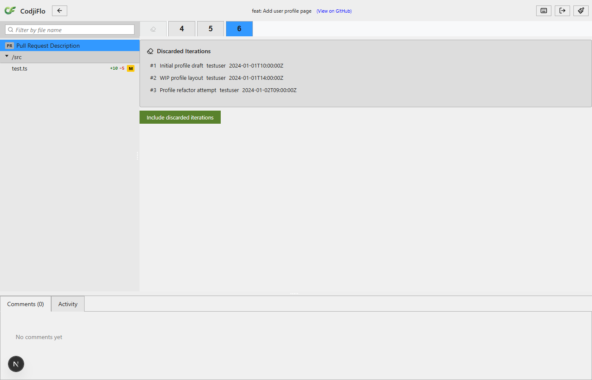
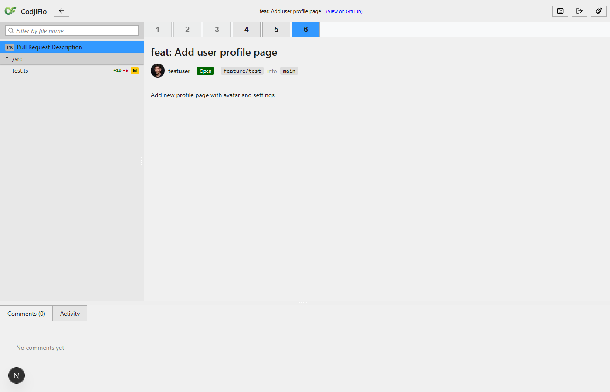
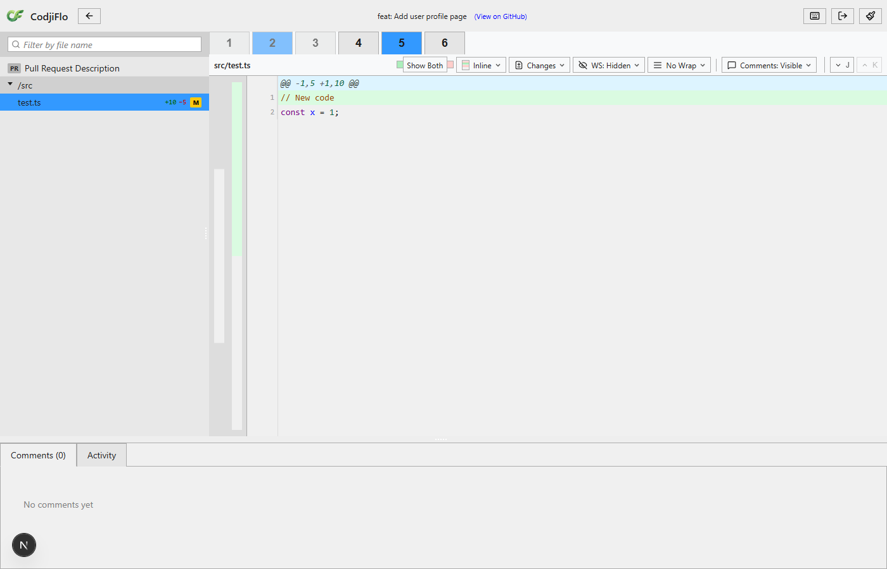
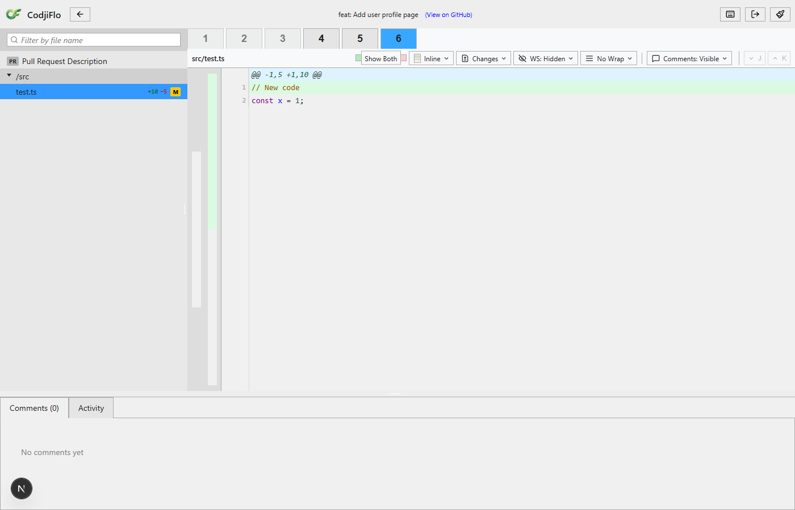
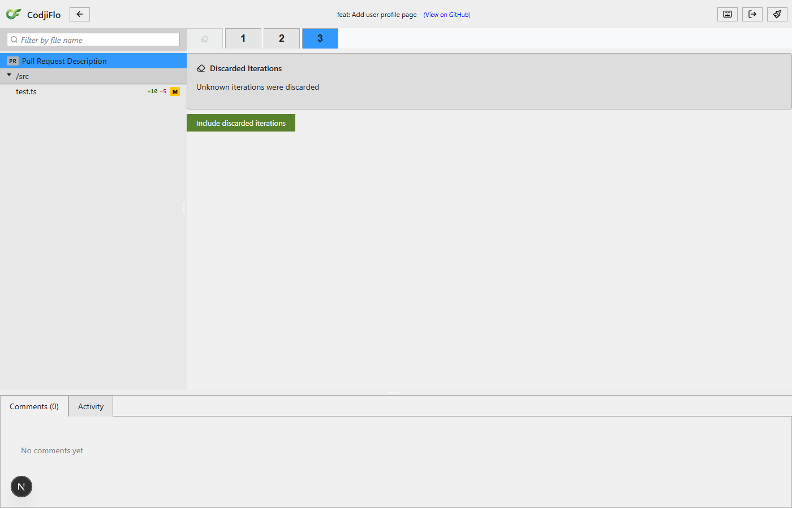
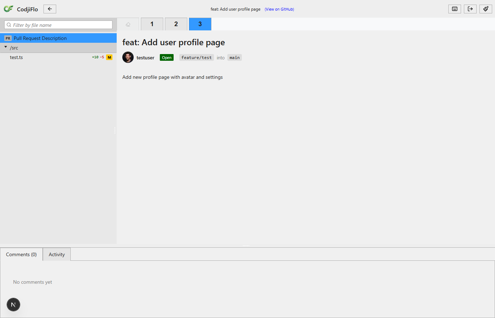

# S-4.2.2: Collapsed Iterations UI - Demo

## Screenshots

### 1. Default Iteration Selector

The iteration selector shows a collapsed group tab (eraser icon) representing 3 discarded iterations from a force push, alongside live iteration tabs 4-6.

### 2. Collapsed Tab Hover

Hovering over the collapsed tab shows the cursor changes to pointer, indicating it is clickable (AC-4.2.2.3).

### 3. History View Open

Clicking the collapsed tab opens the history view showing all 3 discarded commits with revision numbers, commit messages, authors, and dates. The "Include discarded iterations" button is visible at the bottom (AC-4.2.2.3, AC-4.2.2.4).

### 4. Expanded Individual Tabs

After clicking "Include", the collapsed group tab is replaced by individual discarded iteration tabs (1, 2, 3) shown at reduced opacity (0.6) alongside the live tabs (4, 5, 6) at full opacity (AC-4.2.2.5).

### 5. Range Selection Cross-Boundary

Drag-selecting from discarded tab 2 to live tab 5 creates a cross-boundary range. Tabs 2 and 5 are highlighted as range boundaries, tabs 3 and 4 as in-range. The diff content updates accordingly (AC-4.2.2.6).

### 6. Back to Normal Selection

Clicking a single tab (iteration 6) returns to normal single-selection mode with the full base-to-iteration diff.

### 7. Unknown Iterations (GC'd SHA)

When the compare API returns 404 (commits garbage-collected), the history view shows "Unknown iterations were discarded" instead of a commit list. The "Include" button is still available (AC-4.2.2.8).

### 8. Unknown Count Dismissed

After clicking "Include" on an unknown-count group, the history view is dismissed and the collapsed tab remains (since there are no individual iterations to expand).

## Acceptance Criteria Coverage

| AC | Description | Screenshot |
|----|-------------|------------|
| AC-4.2.2.3 | Click collapsed tab opens history view | #3 |
| AC-4.2.2.4 | History view has "Include" button | #3 |
| AC-4.2.2.5 | Expanded group shows individual grayed-out tabs | #4 |
| AC-4.2.2.6 | Expanded tabs participate in range diffs | #5 |
| AC-4.2.2.8 | GC'd commits shown as unavailable | #7 |
