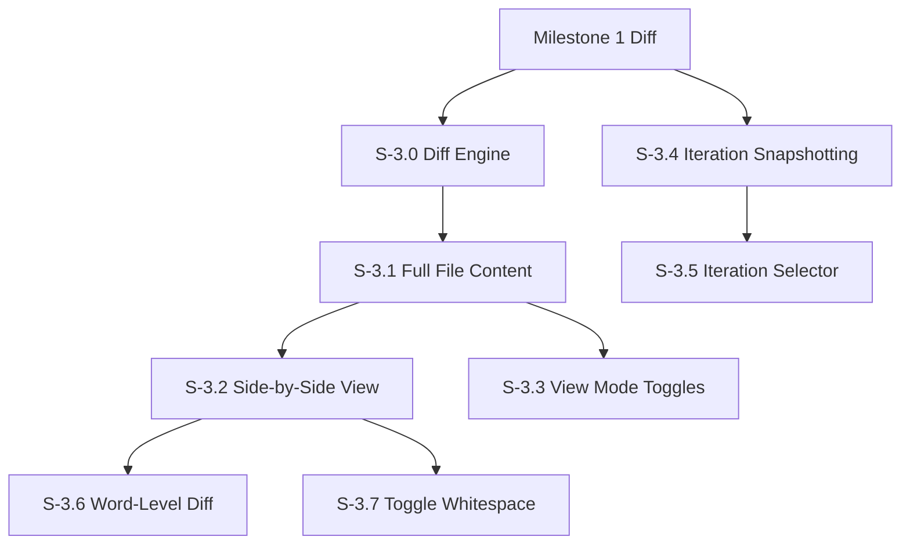

# Milestone 3: Advanced Diff & Iteration Management

**Goal**: Implement the core "CodeFlow-like" diffing capabilities, including side-by-side viewing, full file content display, word-level precision, and the ability to compare arbitrary iterations (review versions).

**Horizontal Requirements**:
- **Test Coverage**: 70% coverage. Complex diff logic (Word-level algorithms) requires comprehensive unit tests.
- **Accessibility**: Screen reader support for side-by-side view (announcing "Left side" vs "Right side" context).

## Architecture & Scaffolding
*Implementation must follow `AGENTS.md` (root). Focus on `workers/diff-worker.ts`.*

## Dependency Graph

---

## [S-3.0] Story 3.0: Diff Engine Scaffolding (Web Worker)

As a developer, I want to compute diffs in a background thread so that the UI remains responsive even for large files.

### Description
Set up a Web Worker infrastructure to handle text diffing algorithms (e.g., using `diff-match-patch` or `myers-diff`).

### Acceptance Criteria
1.  **Worker Setup**:
    - [ ] [AC-3.0.1] `diff.worker.ts` created.
    - [ ] [AC-3.0.2] Async message passing interface defined (`computeDiff(textA, textB) -> DiffResult`).

---

## [S-3.1] Story 3.1: Full File Content Display

As a reviewer, I want to see the full file content (not just changed hunks) so that I can understand the complete context of changes.

### Description
Expand the diff view to show entire file contents with changes highlighted inline. This applies to both unified and side-by-side modes. Users can toggle between "changes only" (hunk view) and "full file" view.

### Acceptance Criteria
1.  **Full File Fetch**:
    - [ ] [AC-3.1.1] Fetch complete file content for both base and head versions via GitHub API (`GET /repos/{owner}/{repo}/contents/{path}?ref={sha}`).
    - [ ] [AC-3.1.2] Cache full file content to avoid redundant API calls when switching view modes.
2.  **Unified Full File View**:
    - [ ] [AC-3.1.3] Display full file with additions highlighted in green background.
    - [ ] [AC-3.1.4] Display full file with deletions highlighted in red background.
    - [ ] [AC-3.1.5] Unchanged lines shown with default background.
    - [ ] [AC-3.1.6] Line numbers reflect actual file line numbers (not hunk-relative).
3.  **Side-by-Side Full File View**:
    - [ ] [AC-3.1.7] Left pane shows complete original file with deletions highlighted.
    - [ ] [AC-3.1.8] Right pane shows complete modified file with additions highlighted.
    - [ ] [AC-3.1.9] Spacer rows inserted to keep corresponding lines aligned.
4.  **Toggle Control**:
    - [ ] [AC-3.1.10] "Full file" / "Changes only" toggle in toolbar.
    - [ ] [AC-3.1.11] Toggle state persisted in local storage.
5.  **Performance**:
    - [ ] [AC-3.1.12] Virtualized rendering for files > 500 lines (use `react-window` or similar).
    - [ ] [AC-3.1.13] Loading skeleton shown while fetching full content.

---

## [S-3.2] Story 3.2: Side-by-Side Diff View

As a reviewer, I want to see the original and modified files side-by-side so that I can easily compare the context of changes.

### Description
Implement the Split View mode.
- Left Pane: Original content ("Base").
- Right Pane: Modified content ("Head").
- Synchronized scrolling.

### Acceptance Criteria
1.  **Layout**:
    - [ ] [AC-3.2.1] Two vertical panes of equal width (resizable optional for now).
    - [ ] [AC-3.2.2] Left pane shows content from base commit.
    - [ ] [AC-3.2.3] Right pane shows content from target commit.
2.  **Scroll Sync**:
    - [ ] [AC-3.2.4] Scrolling one pane scrolls the other precisely.
    - [ ] [AC-3.2.5] "Spacer" blocks inserted to align unchanged lines when one side has additions/deletions.
3.  **Visuals**:
    - [ ] [AC-3.2.6] Deleted lines in Left Pane (Red background).
    - [ ] [AC-3.2.7] Added lines in Right Pane (Green background).
4.  **Accessibility**:
    - [ ] [AC-3.2.8] Screen reader focus can move between panes.
    - [ ] [AC-3.2.9] Aria labels "Original version" and "Modified version".

---

## [S-3.3] Story 3.3: View Mode Toggle Buttons

As a reviewer, I want toggle buttons to switch between view modes so that I can choose the best layout for my review workflow.

### Description
Implement a toolbar with toggle buttons for:
1. **Unified / Side-by-Side** toggle
2. **Left / Both / Right** content filter (what content to show)

### Acceptance Criteria
1.  **Primary View Mode Toggle (Unified/SxS)**:
    - [ ] [AC-3.3.1] Segmented button group with "Unified" and "Side-by-Side" options.
    - [ ] [AC-3.3.2] Active mode visually highlighted.
    - [ ] [AC-3.3.3] Switching modes preserves scroll position (map line numbers between modes).
    - [ ] [AC-3.3.4] Keyboard shortcut `U` for Unified, `S` for Side-by-Side.
2.  **Content Filter Toggle (Left/Both/Right)**:
    - [ ] [AC-3.3.5] Three-way toggle: "Left Only", "Both", "Right Only".
    - [ ] [AC-3.3.6] "Left Only" shows only the original file with deletions highlighted.
    - [ ] [AC-3.3.7] "Both" shows the standard diff view (default).
    - [ ] [AC-3.3.8] "Right Only" shows only the modified file with additions highlighted.
    - [ ] [AC-3.3.9] Filter applies to both Unified and Side-by-Side modes.
3.  **Toolbar Layout**:
    - [ ] [AC-3.3.10] Toggles positioned in diff viewer toolbar (right-aligned).
    - [ ] [AC-3.3.11] Tooltips on hover explaining each mode.
    - [ ] [AC-3.3.12] Icons + text labels (collapsible to icons-only on narrow screens).
4.  **State Persistence**:
    - [ ] [AC-3.3.13] View mode preference saved to local storage.
    - [ ] [AC-3.3.14] Content filter preference saved to local storage.
5.  **Accessibility**:
    - [ ] [AC-3.3.15] Toggle buttons are keyboard navigable (arrow keys within group).
    - [ ] [AC-3.3.16] Aria-pressed state correctly set on active button.

---

## [S-3.4] Story 3.4: Iteration Snapshotting

As a reviewer, I want the system to capture iteration snapshots so that I can compare any two points in the PR's history, even after force-pushes.

### Description
Implement the iteration snapshot system using **GitHub Action + Artifact** approach. A workflow runs on PR events, captures snapshots to SQLite, and uploads as artifact. Frontend loads iterations from artifact.

See [spec/functional/iterations.md](../functional/iterations.md) for the full iteration model and storage architecture.

### Acceptance Criteria

1.  **GitHub Action (codjiflo/action)**:
    - [ ] [AC-3.4.1] Action triggers on `pull_request` events (opened, synchronize, reopened).
    - [ ] [AC-3.4.2] Download previous artifact if exists (continue-on-error for first run).
    - [ ] [AC-3.4.3] Capture `head_sha`, `base_sha`, `before` from event payload.
    - [ ] [AC-3.4.4] Fetch changed file contents via GitHub API.
    - [ ] [AC-3.4.5] Append new iteration to SQLite database.
    - [ ] [AC-3.4.6] Upload SQLite as artifact with 90-day retention.

2.  **PR Comment Pointer (codjiflo/comment-action)**:
    - [ ] [AC-3.4.7] Find existing CodjiFlo comment or create new one.
    - [ ] [AC-3.4.8] Comment format: `<!-- codjiflo-data -->` marker + artifact reference + timestamp.
    - [ ] [AC-3.4.9] Update comment on each workflow run (not create new).

3.  **Frontend Artifact Loader**:
    - [ ] [AC-3.4.10] Fetch PR comments, find `<!-- codjiflo-data -->` marker.
    - [ ] [AC-3.4.11] Extract artifact URL from comment.
    - [ ] [AC-3.4.12] Download SQLite artifact.
    - [ ] [AC-3.4.13] Parse SQLite using SQL.js (WASM).
    - [ ] [AC-3.4.14] Cache artifact in IndexedDB for subsequent loads.

4.  **Graceful Degradation**:
    - [ ] [AC-3.4.15] If no CodjiFlo comment found, fetch PR commits from GitHub API.
    - [ ] [AC-3.4.16] Enable commit range comparison (parity with GitHub native).
    - [ ] [AC-3.4.17] Show banner: "Install workflow for force-push resilience and comment tracking".

5.  **SQLite Schema**:
    - [ ] [AC-3.4.18] `iterations` table: id, revision, head_sha, base_sha, before_sha, author, created_at.
    - [ ] [AC-3.4.19] `file_artifacts` table: id, change_tracking_id.
    - [ ] [AC-3.4.20] `artifact_snapshots` table: artifact_id, snapshot_index, file_path.
    - [ ] [AC-3.4.21] `file_contents` table: artifact_id, snapshot_index, content, content_hash.
    - [ ] [AC-3.4.22] `comment_anchors` table: artifact_id, snapshot indices, line/column positions.
    - [ ] [AC-3.4.23] `span_trackers` table: precomputed SpanTracker data per file/snapshot pair.

6.  **Precomputed SpanTrackers**:
    - [ ] [AC-3.4.24] Compute SpanTrackers for adjacent iteration pairs (0→1, 2→3, etc.).
    - [ ] [AC-3.4.25] Compute SpanTracker for base→latest (snapshot 0 → latest right snapshot).
    - [ ] [AC-3.4.26] Serialize SpanTracker data to BLOB for storage.

7.  **Data Model**:
    - [ ] [AC-3.4.27] Implement `Iteration` interface per spec.
    - [ ] [AC-3.4.28] Implement `ReviewFileArtifact` interface per spec.
    - [ ] [AC-3.4.29] Implement snapshot index conversion functions (iteration ↔ snapshot).

---

## [S-3.5] Story 3.5: Iteration Selector & Comparison

As a reviewer, I want to compare "Last Reviewed" vs "Latest" so I only see what's new since my last review.

### Description
Provide a selector mechanism to choose any two iterations for comparison. Iterations are loaded from the SQLite artifact (see S-3.4). Diffs are computed client-side from stored file contents.

### Acceptance Criteria

1.  **UI Controls**:
    - [ ] [AC-3.5.1] Two dropdowns: "Compare from" and "Compare to".
    - [ ] [AC-3.5.2] Dropdown options populated from `iterations` table in SQLite artifact.
    - [ ] [AC-3.5.3] Options include: "Base branch", each iteration ("Update 1", "Update 2"...), "Latest".
    - [ ] [AC-3.5.4] Quick preset: "Since last review" (if review history exists).
    - [ ] [AC-3.5.5] Visual indicator showing iteration timeline/commits.

2.  **Diff Computation (from artifact)**:
    - [ ] [AC-3.5.6] Load file contents from `file_contents` table for selected snapshots.
    - [ ] [AC-3.5.7] Compute diff client-side using stored content (no GitHub API call).
    - [ ] [AC-3.5.8] Support cross-iteration comparison (non-adjacent iterations).
    - [ ] [AC-3.5.9] Update diff view with computed changes.

3.  **Degraded Mode (no artifact)**:
    - [ ] [AC-3.5.10] If no artifact, fetch PR commits via GitHub API.
    - [ ] [AC-3.5.11] Populate iteration selector with commit list (parity with GitHub's commit range picker).
    - [ ] [AC-3.5.12] Diff via GitHub `/compare/{base}...{head}` endpoint.
    - [ ] [AC-3.5.13] Display banner: "Install workflow for force-push resilience and comment tracking".

4.  **SpanTracker Integration**:
    - [ ] [AC-3.5.14] Load precomputed SpanTrackers from `span_trackers` table (adjacent + base→latest).
    - [ ] [AC-3.5.15] For cross-iteration comparisons, chain adjacent SpanTrackers client-side.
    - [ ] [AC-3.5.16] Cache computed SpanTrackers by snapshot pair key for performance.
    - [ ] [AC-3.5.17] Comments correctly positioned using span tracking.

5.  **Accessibility**:
    - [ ] [AC-3.5.18] Dropdowns labeled "Compare from" and "Compare to".
    - [ ] [AC-3.5.19] Selection changes announced to screen readers.

---

## [S-3.6] Story 3.6: Word-Level Diff Highlighting

As a reviewer, I want to see exactly which variable changed in a line so I don't have to scan the whole line.

### Description
Refine the diff visualization. For lines that are modified (not fully added/removed), run a sub-line diff algorithm (e.g., `diff-match-patch`) to highlight specific character/word changes.

### Acceptance Criteria
1.  **Visualization**:
    - [ ] [AC-3.6.1] Modified lines show a lighter background color.
    - [ ] [AC-3.6.2] Specific changed characters/words show a darker/saturated background color.
2.  **Algorithm**:
    - [ ] [AC-3.6.3] Only runs on pairs of lines identified as "Modified" (not pure add/delete).
    - [ ] [AC-3.6.4] Correctly identifies common changes (variable rename, argument change).
    - [ ] [AC-3.6.5] Runs in Web Worker to avoid blocking UI.
3.  **Accessibility**:
    - [ ] [AC-3.6.6] Screen reader announces "Line X modified. Original: [...], New: [...]".

