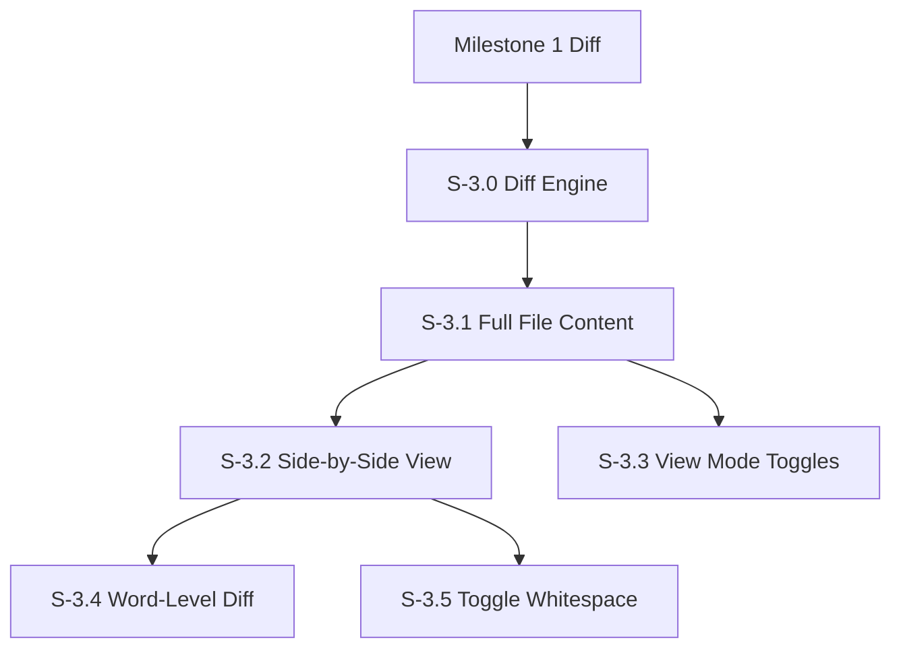

# Milestone 3: Advanced Diff Engine

**Goal**: Implement the core diff viewing capabilities, including side-by-side viewing, full file content display, word-level precision, and view mode controls. This milestone focuses on the diff engine and visualization; iteration tracking is handled in Milestone 4.

**Horizontal Requirements**:
- **Test Coverage**: 70% coverage. Complex diff logic (word-level algorithms) requires comprehensive unit tests.
- **Accessibility**: Screen reader support for side-by-side view (announcing "Left side" vs "Right side" context).

## Architecture & Scaffolding
*Implementation must follow `AGENTS.md` (root). Focus on `workers/diff-worker.ts` and `features/diff`.*

## Dependency Graph

---

## [S-3.0] Story 3.0: Diff Engine Scaffolding (Web Worker)

As a developer, I want to compute diffs in a background thread so that the UI remains responsive even for large files.

### Description
Set up a Web Worker infrastructure to handle text diffing algorithms (e.g., using `diff-match-patch` or `myers-diff`).

### Acceptance Criteria
1.  **Worker Setup**:
    - [ ] [AC-3.0.1] `diff.worker.ts` created.
    - [ ] [AC-3.0.2] Async message passing interface defined (`computeDiff(textA, textB) -> DiffResult`).

---

## [S-3.1] Story 3.1: Full File Content Display

As a reviewer, I want to see the full file content (not just changed hunks) so that I can understand the complete context of changes.

### Description
Expand the diff view to show entire file contents with changes highlighted inline. This applies to both unified and side-by-side modes. Users can toggle between "changes only" (hunk view) and "full file" view.

### Acceptance Criteria
1.  **Full File Fetch**:
    - [ ] [AC-3.1.1] Fetch complete file content for both base and head versions via GitHub API (`GET /repos/{owner}/{repo}/contents/{path}?ref={sha}`).
    - [ ] [AC-3.1.2] Cache full file content to avoid redundant API calls when switching view modes.
2.  **Unified Full File View**:
    - [ ] [AC-3.1.3] Display full file with additions highlighted in green background.
    - [ ] [AC-3.1.4] Display full file with deletions highlighted in red background.
    - [ ] [AC-3.1.5] Unchanged lines shown with default background.
    - [ ] [AC-3.1.6] Line numbers reflect actual file line numbers (not hunk-relative).
3.  **Side-by-Side Full File View**:
    - [ ] [AC-3.1.7] Left pane shows complete original file with deletions highlighted.
    - [ ] [AC-3.1.8] Right pane shows complete modified file with additions highlighted.
    - [ ] [AC-3.1.9] Spacer rows inserted to keep corresponding lines aligned.
4.  **Toggle Control**:
    - [ ] [AC-3.1.10] "Full file" / "Changes only" toggle in toolbar.
    - [ ] [AC-3.1.11] Toggle state persisted in local storage.
5.  **Performance**:
    - [ ] [AC-3.1.12] Virtualized rendering for files > 500 lines (use `react-window` or similar).
    - [ ] [AC-3.1.13] Loading skeleton shown while fetching full content.

---

## [S-3.2] Story 3.2: Side-by-Side Diff View

As a reviewer, I want to see the original and modified files side-by-side so that I can easily compare the context of changes.

### Description
Implement the Split View mode.
- Left Pane: Original content ("Base").
- Right Pane: Modified content ("Head").
- Synchronized scrolling.

### Acceptance Criteria
1.  **Layout**:
    - [ ] [AC-3.2.1] Two vertical panes of equal width (resizable optional for now).
    - [ ] [AC-3.2.2] Left pane shows content from base commit.
    - [ ] [AC-3.2.3] Right pane shows content from target commit.
2.  **Scroll Sync**:
    - [ ] [AC-3.2.4] Scrolling one pane scrolls the other precisely.
    - [ ] [AC-3.2.5] "Spacer" blocks inserted to align unchanged lines when one side has additions/deletions.
3.  **Visuals**:
    - [ ] [AC-3.2.6] Deleted lines in Left Pane (Red background).
    - [ ] [AC-3.2.7] Added lines in Right Pane (Green background).
4.  **Accessibility**:
    - [ ] [AC-3.2.8] Screen reader focus can move between panes.
    - [ ] [AC-3.2.9] Aria labels "Original version" and "Modified version".

---

## [S-3.3] Story 3.3: View Mode Toggle Buttons

As a reviewer, I want toggle buttons to switch between view modes so that I can choose the best layout for my review workflow.

### Description
Implement a toolbar with toggle buttons for:
1. **Unified / Side-by-Side** toggle
2. **Left / Both / Right** content filter (what content to show)

### Acceptance Criteria
1.  **Primary View Mode Toggle (Unified/SxS)**:
    - [ ] [AC-3.3.1] Segmented button group with "Unified" and "Side-by-Side" options.
    - [ ] [AC-3.3.2] Active mode visually highlighted.
    - [ ] [AC-3.3.3] Switching modes preserves scroll position (map line numbers between modes).
    - [ ] [AC-3.3.4] Keyboard shortcut `I` for Inline (Unified), `X` for Side-by-Side.
2.  **Content Filter Toggle (Left/Both/Right)**:
    - [ ] [AC-3.3.5] Three-way toggle: "Left", "Both", "Right".
    - [ ] [AC-3.3.6] "Both" shows the standard diff view (default).
    - [ ] [AC-3.3.7] Filter applies to both Unified and Split modes.
3.  **Content Filter in Split Mode**:
    - [ ] [AC-3.3.8] "Left" hides the right pane, showing only the original file.
    - [ ] [AC-3.3.9] "Both" shows both panes side-by-side (default).
    - [ ] [AC-3.3.10] "Right" hides the left pane, showing only the modified file.
4.  **Content Filter in Unified Mode**:
    - [ ] [AC-3.3.11] "Left" shows only removed lines and unchanged lines (added lines hidden).
    - [ ] [AC-3.3.12] "Both" shows all three line types: removed, added, and unchanged (default).
    - [ ] [AC-3.3.13] "Right" shows only added lines and unchanged lines (removed lines hidden).
    - [ ] [AC-3.3.14] Line numbers in "Left" mode reflect original file line numbers.
    - [ ] [AC-3.3.15] Line numbers in "Right" mode reflect modified file line numbers.
5.  **Toolbar Layout**:
    - [ ] [AC-3.3.16] Toggles positioned in diff viewer toolbar (right-aligned).
    - [ ] [AC-3.3.17] Tooltips on hover explaining each mode.
    - [ ] [AC-3.3.18] Icons + text labels (collapsible to icons-only on narrow screens).
6.  **State Persistence**:
    - [ ] [AC-3.3.19] View mode preference saved to local storage.
    - [ ] [AC-3.3.20] Content filter preference saved to local storage.
7.  **Accessibility**:
    - [ ] [AC-3.3.21] Toggle buttons are keyboard navigable (arrow keys within group).
    - [ ] [AC-3.3.22] Aria-pressed state correctly set on active button.

---

## [S-3.4] Story 3.4: Word-Level Diff Highlighting

As a reviewer, I want to see exactly which variable changed in a line so I don't have to scan the whole line.

### Description
Refine the diff visualization. For lines that are modified (not fully added/removed), run a sub-line diff algorithm (e.g., `diff-match-patch`) to highlight specific character/word changes.

### Acceptance Criteria
1.  **Visualization**:
    - [ ] [AC-3.4.1] Modified lines show a lighter background color.
    - [ ] [AC-3.4.2] Specific changed characters/words show a darker/saturated background color.
2.  **Algorithm**:
    - [ ] [AC-3.4.3] Only runs on pairs of lines identified as "Modified" (not pure add/delete).
    - [ ] [AC-3.4.4] Correctly identifies common changes (variable rename, argument change).
    - [ ] [AC-3.4.5] Runs in Web Worker to avoid blocking UI.
3.  **Accessibility**:
    - [ ] [AC-3.4.6] Screen reader announces "Line X modified. Original: [...], New: [...]".

---

## [S-3.5] Story 3.5: Toggle Whitespace Visibility

As a reviewer, I want to ignore whitespace changes so I can focus on code logic.

### Description
Add a settings toggle "Ignore Whitespace" that filters or hides whitespace-only changes.

### Acceptance Criteria
1.  **Functionality**:
    - [ ] [AC-3.5.1] Toggle ON: Re-fetches or re-renders diff with `?w=1` (GitHub API whitespace ignore) or filters whitespace-only hunks client-side.
    - [ ] [AC-3.5.2] Toggle OFF: Standard view showing all changes.
2.  **Persistence**:
    - [ ] [AC-3.5.3] Setting saved in local storage.
3.  **UI**:
    - [ ] [AC-3.5.4] Toggle in toolbar near view mode toggles.
    - [ ] [AC-3.5.5] Visual indicator when whitespace is being ignored.
