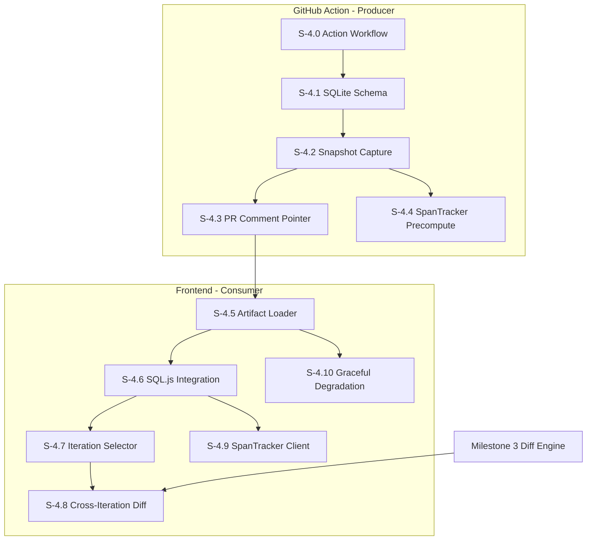

# Milestone 4: Iteration Management

**Goal**: Implement the iteration tracking system that enables force-push resilient code review. This milestone is split into two phases: **Producer** (GitHub Action that captures iterations to SQLite artifacts) and **Consumer** (Frontend that loads and uses artifact data).

**Horizontal Requirements**:
- **Test Coverage**: 70% coverage. SQLite schema and parsing logic requires comprehensive unit tests.
- **Accessibility**: Iteration selector controls must be keyboard navigable with clear labeling.

## Architecture & Scaffolding
*Implementation must follow `AGENTS.md` (root). Focus on `codjiflo/action` (GitHub Action) and `features/iterations` (Frontend).*

See [spec/functional/iterations.md](../functional/iterations.md) for the full iteration model and storage architecture.

## Dependency Graph

---

# Phase 1: Producer (GitHub Action)

## [S-4.0] Story 4.0: GitHub Action Workflow Setup

As a repository owner, I want to install a GitHub Action that tracks PR iterations so that my team gets force-push resilient code review.

### Description
Create the `codjiflo/action` GitHub Action that triggers on PR events. Set up the workflow structure, artifact download/upload mechanics, and GitHub API authentication.

### Acceptance Criteria
1.  **Workflow Trigger**:
    - [ ] [AC-4.0.1] Action triggers on `pull_request` events: `opened`, `synchronize`, `reopened`.
    - [ ] [AC-4.0.2] Workflow file template provided for easy installation (`codjiflo.yml`).
    - [ ] [AC-4.0.3] Action published to GitHub Marketplace or installable from repository.
2.  **Artifact Lifecycle**:
    - [ ] [AC-4.0.4] Download previous artifact if exists (continue-on-error for first run).
    - [ ] [AC-4.0.5] Upload updated artifact with 90-day retention.
    - [ ] [AC-4.0.6] Artifact named consistently: `codjiflo-pr-{pr_number}`.
3.  **Authentication**:
    - [ ] [AC-4.0.7] Use `GITHUB_TOKEN` for API access (automatic in Actions).
    - [ ] [AC-4.0.8] Handle rate limiting gracefully with exponential backoff.

---

## [S-4.1] Story 4.1: SQLite Schema & Database Management

As a developer, I want a well-defined SQLite schema so that iteration data is stored efficiently and can be queried by the frontend.

### Description
Design and implement the SQLite database schema for storing iterations, file artifacts, file contents, and span trackers. Implement database creation and migration logic.

### Acceptance Criteria
1.  **Schema Tables**:
    - [ ] [AC-4.1.1] `iterations` table: id, revision, head_sha, base_sha, before_sha, author, created_at.
    - [ ] [AC-4.1.2] `file_artifacts` table: id, change_tracking_id (unique).
    - [ ] [AC-4.1.3] `artifact_snapshots` table: artifact_id, snapshot_index, file_path.
    - [ ] [AC-4.1.4] `file_contents` table: artifact_id, snapshot_index, content, content_hash, size_bytes.
    - [ ] [AC-4.1.5] `comment_anchors` table: artifact_id, snapshot indices, line/column positions, github_comment_id.
    - [ ] [AC-4.1.6] `span_trackers` table: artifact_id, left_snapshot_index, right_snapshot_index, span_data (BLOB).
2.  **Database Operations**:
    - [ ] [AC-4.1.7] Create new database if none exists.
    - [ ] [AC-4.1.8] Open and append to existing database from artifact.
    - [ ] [AC-4.1.9] Content deduplication via content_hash (avoid storing duplicate file contents).
3.  **Constraints**:
    - [ ] [AC-4.1.10] Unique constraint on (artifact_id, snapshot_index) pairs.
    - [ ] [AC-4.1.11] Foreign key relationships enforced.

---

## [S-4.2] Story 4.2: Iteration Snapshot Capture

As a developer, I want the action to capture complete iteration snapshots so that file contents are preserved even after force-pushes.

### Description
Implement the core capture logic: extract iteration metadata from the PR event payload, fetch changed file contents via GitHub API, and store in SQLite.

### Acceptance Criteria
1.  **Event Parsing**:
    - [ ] [AC-4.2.1] Extract `head_sha` from `pull_request.head.sha`.
    - [ ] [AC-4.2.2] Extract `base_sha` from `pull_request.base.sha`.
    - [ ] [AC-4.2.3] Extract `before` SHA from event payload (for force-push detection).
    - [ ] [AC-4.2.4] Calculate revision number from existing iterations + 1.
2.  **File Content Fetch**:
    - [ ] [AC-4.2.5] Fetch list of changed files via `GET /repos/{owner}/{repo}/pulls/{pr}/files`.
    - [ ] [AC-4.2.6] Fetch file content for each changed file at head_sha via `GET /repos/{owner}/{repo}/contents/{path}?ref={sha}`.
    - [ ] [AC-4.2.7] Fetch file content at base_sha for comparison.
    - [ ] [AC-4.2.8] Handle binary files gracefully (store metadata only, not content).
    - [ ] [AC-4.2.9] Handle large files (>1MB) with truncation or reference-only storage.
3.  **Snapshot Storage**:
    - [ ] [AC-4.2.10] Create left snapshot (even index) with base content.
    - [ ] [AC-4.2.11] Create right snapshot (odd index) with head content.
    - [ ] [AC-4.2.12] Track file renames by matching change_tracking_id.
    - [ ] [AC-4.2.13] Insert iteration record with all metadata.

---

## [S-4.3] Story 4.3: PR Comment Pointer Management

As a frontend consumer, I want a reliable way to discover the artifact URL so that I can download iteration data.

### Description
Implement the `codjiflo/comment-action` that posts/updates a PR comment containing the artifact reference. This comment serves as the discovery mechanism for the frontend.

### Acceptance Criteria
1.  **Comment Detection**:
    - [ ] [AC-4.3.1] Search PR comments for `<!-- codjiflo-data -->` marker.
    - [ ] [AC-4.3.2] If found, update existing comment.
    - [ ] [AC-4.3.3] If not found, create new comment.
2.  **Comment Content**:
    - [ ] [AC-4.3.4] Include hidden marker: `<!-- codjiflo-data -->`.
    - [ ] [AC-4.3.5] Include artifact download URL or run ID reference.
    - [ ] [AC-4.3.6] Include timestamp of last update.
    - [ ] [AC-4.3.7] Include iteration count for user visibility.
    - [ ] [AC-4.3.8] Human-readable message explaining CodjiFlo integration.
3.  **Robustness**:
    - [ ] [AC-4.3.9] Handle comment creation failures gracefully (log, don't fail workflow).
    - [ ] [AC-4.3.10] Use bot account or action identity for consistent authorship.

---

## [S-4.4] Story 4.4: Precomputed SpanTrackers

As a frontend consumer, I want precomputed span tracking data so that comment position mapping is fast without heavy client-side computation.

### Description
Compute SpanTracker data for common comparison pairs during the action run. Store serialized tracker data in SQLite for frontend consumption.

### Acceptance Criteria
1.  **Adjacent Pair Computation**:
    - [ ] [AC-4.4.1] Compute SpanTracker for each iteration's left→right (e.g., 0→1, 2→3).
    - [ ] [AC-4.4.2] Run diff algorithm on file content pairs.
    - [ ] [AC-4.4.3] Serialize SpanTracker mapping data to BLOB.
2.  **Base→Latest Computation**:
    - [ ] [AC-4.4.4] Compute SpanTracker from snapshot 0 to latest right snapshot.
    - [ ] [AC-4.4.5] Update on each new iteration.
3.  **Storage**:
    - [ ] [AC-4.4.6] Store in `span_trackers` table with unique (artifact_id, left, right) key.
    - [ ] [AC-4.4.7] Efficient serialization format (consider MessagePack or JSON).
4.  **Performance**:
    - [ ] [AC-4.4.8] Skip computation for unchanged files (content_hash match).
    - [ ] [AC-4.4.9] Parallelize computation across files where possible.

---

# Phase 2: Consumer (Frontend)

## [S-4.5] Story 4.5: Artifact Discovery & Download

As a frontend user, I want the app to automatically find and download iteration data so that I can use advanced review features.

### Description
Implement the artifact loader that discovers the CodjiFlo PR comment, extracts the artifact reference, and downloads the SQLite database.

### Acceptance Criteria
1.  **Comment Discovery**:
    - [ ] [AC-4.5.1] Fetch PR comments via GitHub API.
    - [ ] [AC-4.5.2] Search for `<!-- codjiflo-data -->` marker in comment bodies.
    - [ ] [AC-4.5.3] Extract artifact URL/run ID from comment.
2.  **Artifact Download**:
    - [ ] [AC-4.5.4] Download artifact ZIP from GitHub Actions API.
    - [ ] [AC-4.5.5] Extract SQLite file from ZIP.
    - [ ] [AC-4.5.6] Handle authentication (user token with `actions:read` scope).
3.  **Caching**:
    - [ ] [AC-4.5.7] Cache downloaded artifact in IndexedDB.
    - [ ] [AC-4.5.8] Check comment timestamp to detect stale cache.
    - [ ] [AC-4.5.9] Invalidate cache when new iteration detected.
4.  **Error Handling**:
    - [ ] [AC-4.5.10] Handle missing comment (trigger graceful degradation).
    - [ ] [AC-4.5.11] Handle expired artifact (90-day retention exceeded).
    - [ ] [AC-4.5.12] Handle permission errors (private repo, insufficient scope).

---

## [S-4.6] Story 4.6: SQL.js Integration & Database Parsing

As a frontend developer, I want to query SQLite in the browser so that I can access iteration data without a backend.

### Description
Integrate SQL.js (SQLite compiled to WebAssembly) to load and query the downloaded artifact database.

### Acceptance Criteria
1.  **SQL.js Setup**:
    - [ ] [AC-4.6.1] Install and configure SQL.js with WASM loader.
    - [ ] [AC-4.6.2] Initialize database from downloaded ArrayBuffer.
    - [ ] [AC-4.6.3] Handle WASM loading in Next.js environment.
2.  **Query Interface**:
    - [ ] [AC-4.6.4] `getIterations()`: Return all iterations sorted by revision.
    - [ ] [AC-4.6.5] `getFileArtifacts(iterationId)`: Return files changed in iteration.
    - [ ] [AC-4.6.6] `getFileContent(artifactId, snapshotIndex)`: Return file content.
    - [ ] [AC-4.6.7] `getSpanTracker(artifactId, leftSnapshot, rightSnapshot)`: Return tracker data.
3.  **Data Models**:
    - [ ] [AC-4.6.8] Implement `Iteration` interface per spec.
    - [ ] [AC-4.6.9] Implement `ReviewFileArtifact` interface per spec.
    - [ ] [AC-4.6.10] Implement snapshot index conversion functions.
4.  **Performance**:
    - [ ] [AC-4.6.11] Lazy-load file contents (don't load all at once).
    - [ ] [AC-4.6.12] Use prepared statements for repeated queries.

---

## [S-4.7] Story 4.7: Iteration Selector UI

As a reviewer, I want to select which iterations to compare so that I can focus on specific changes.

### Description
Provide UI controls for selecting iteration comparison range. Integrate with the artifact data to populate options.

### Acceptance Criteria
1.  **UI Controls**:
    - [ ] [AC-4.7.1] Two dropdowns: "Compare from" and "Compare to".
    - [ ] [AC-4.7.2] Populate options from iterations table.
    - [ ] [AC-4.7.3] Options include: "Base", each iteration ("Update 1", "Update 2"...), "Latest".
    - [ ] [AC-4.7.4] Visual timeline showing iteration sequence.
2.  **Quick Presets**:
    - [ ] [AC-4.7.5] "Full diff" preset: Base → Latest.
    - [ ] [AC-4.7.6] "Latest update" preset: Previous → Latest.
    - [ ] [AC-4.7.7] "Since last review" preset (if review history available).
3.  **State Management**:
    - [ ] [AC-4.7.8] Store selected range in Zustand store.
    - [ ] [AC-4.7.9] Persist last selection in localStorage per PR.
    - [ ] [AC-4.7.10] URL sync: encode selection in query params.
4.  **Accessibility**:
    - [ ] [AC-4.7.11] Dropdowns labeled with "Compare from" and "Compare to".
    - [ ] [AC-4.7.12] Selection changes announced to screen readers.
    - [ ] [AC-4.7.13] Keyboard navigation between presets.

---

## [S-4.8] Story 4.8: Cross-Iteration Diff Computation

As a reviewer, I want to see diffs between any two iterations so that I can understand incremental changes.

### Description
Compute diffs client-side using file contents from the SQLite artifact. Support non-adjacent iteration comparisons. The file list and diff statistics dynamically reflect the selected iteration range.

### Acceptance Criteria
1.  **Diff Computation**:
    - [ ] [AC-4.8.1] Load file contents from `file_contents` table for selected snapshots.
    - [ ] [AC-4.8.2] Compute diff using Web Worker (from M3 diff engine).
    - [ ] [AC-4.8.3] Support cross-iteration comparison (non-adjacent).
    - [ ] [AC-4.8.4] Handle file additions/deletions/renames across iterations.
2.  **File Matching**:
    - [ ] [AC-4.8.5] Match files by artifact ID (handles renames).
    - [ ] [AC-4.8.6] Detect files only in left snapshot (deleted).
    - [ ] [AC-4.8.7] Detect files only in right snapshot (added).
3.  **View Integration**:
    - [ ] [AC-4.8.8] Update diff view with computed changes.
    - [ ] [AC-4.8.9] Update file tree to show changed files for selected range.
    - [ ] [AC-4.8.10] Show iteration metadata in UI (author, timestamp).
4.  **Iteration-Aware File List**:
    - [ ] [AC-4.8.11] Hide files from list when iteration diff is empty (no changes between selected snapshots).
    - [ ] [AC-4.8.12] Lines added counter (`+N`) reflects actual additions in iteration diff, not GitHub patch.
    - [ ] [AC-4.8.13] Lines removed counter (`-M`) reflects actual deletions in iteration diff, not GitHub patch.
    - [ ] [AC-4.8.14] File status badge (Added/Modified/Deleted/Renamed) computed from iteration range.
    - [ ] [AC-4.8.15] When switching iteration range, file list immediately updates to show only affected files.

---

## [S-4.9] Story 4.9: SpanTracker Client Integration

As a reviewer, I want comments to track correctly across iterations so that I can follow discussions as code changes.

### Description
Load and use precomputed SpanTrackers from the artifact. Chain trackers for cross-iteration comparisons.

### Acceptance Criteria
1.  **Tracker Loading**:
    - [ ] [AC-4.9.1] Load precomputed SpanTrackers from `span_trackers` table.
    - [ ] [AC-4.9.2] Deserialize BLOB data to SpanTracker objects.
    - [ ] [AC-4.9.3] Cache loaded trackers by (artifact, left, right) key.
2.  **Cross-Iteration Chaining**:
    - [ ] [AC-4.9.4] For non-adjacent comparisons, chain adjacent trackers.
    - [ ] [AC-4.9.5] Cache computed cross-iteration trackers.
    - [ ] [AC-4.9.6] Handle gaps in tracker chain gracefully.
3.  **Comment Position Mapping**:
    - [ ] [AC-4.9.7] Map comment locations forward through iterations.
    - [ ] [AC-4.9.8] Map comment locations backward for historical view.
    - [ ] [AC-4.9.9] Handle orphaned comments (deleted code).
4.  **Performance**:
    - [ ] [AC-4.9.10] Lazy-load trackers as needed.
    - [ ] [AC-4.9.11] Preload trackers for visible files.

---

## [S-4.10] Story 4.10: Graceful Degradation

As a user reviewing a repo without the CodjiFlo workflow, I want basic iteration comparison so that I can still use the app.

### Description
Implement fallback behavior when no CodjiFlo artifact is available. Use GitHub's native commit history for iteration-like comparison.

### Acceptance Criteria
1.  **Detection**:
    - [ ] [AC-4.10.1] Detect missing `<!-- codjiflo-data -->` comment.
    - [ ] [AC-4.10.2] Detect expired/unavailable artifact.
2.  **Fallback Data Source**:
    - [ ] [AC-4.10.3] Fetch PR commits via `GET /repos/{owner}/{repo}/pulls/{pr}/commits`.
    - [ ] [AC-4.10.4] Populate iteration selector with commit list.
    - [ ] [AC-4.10.5] Fetch diffs via `GET /repos/{owner}/{repo}/compare/{base}...{head}`.
3.  **Feature Limitations**:
    - [ ] [AC-4.10.6] Disable SpanTracker-based comment tracking.
    - [ ] [AC-4.10.7] Show banner: "Install CodjiFlo workflow for force-push resilience".
    - [ ] [AC-4.10.8] Link to workflow installation instructions.
4.  **User Experience**:
    - [ ] [AC-4.10.9] Clear indication of degraded mode in UI.
    - [ ] [AC-4.10.10] No broken functionality - just reduced features.
    - [ ] [AC-4.10.11] Seamless upgrade path when workflow is installed.
