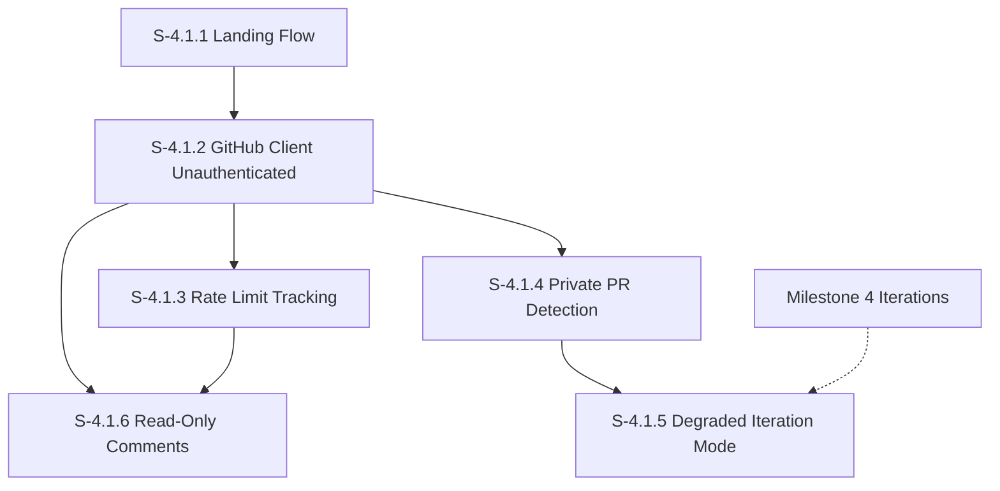

# Milestone 4.1: Unauthenticated Experience

**Goal**: Enable unauthenticated users to review public pull requests without mandatory login. Authentication is requested contextually when users attempt actions that require it (posting comments, accessing private repos, downloading iteration artifacts).

**Horizontal Requirements**:
- **Test Coverage**: 70% coverage. Rate limit tracking and auth detection require comprehensive unit tests.
- **E2E Testing**: Critical paths covered by Playwright in mock mode with unauthenticated API mocking.
- **Accessibility**:
  - Login prompts are keyboard accessible with clear focus management.
  - Rate limit warnings use ARIA live regions for screen reader announcements.
  - Banners and prompts meet WCAG 2.1 AA color contrast requirements.

## Architecture & Scaffolding
*Implementation must follow `AGENTS.md` (root). Focus on `features/auth` module enhancements.*

**Key Architectural Changes**:
- `src/api/github/github-client.ts`: Support optional token (allow unauthenticated requests for public repos)
- `src/features/auth/hooks/useOptionalAuth.ts`: New hook for pages that work without auth
- `src/features/auth/stores/useAuthStore.ts`: Add rate limit tracking state
- New components for contextual login prompts

See [spec/functional/unauthenticated-access.md](../functional/unauthenticated-access.md) for the full specification.

## Dependency Graph

---

## [S-4.1.1] Story 4.1.1: Unauthenticated Landing Flow

As a new visitor, I want to access the dashboard immediately without logging in so that I can quickly view a public pull request.

### Description
Modify the application entry flow to be unauthenticated-first. Users land directly on the dashboard where they can enter a PR URL. A login button is available but not required for initial access to public repositories.

### Acceptance Criteria

1. **Landing Experience**:
   - [ ] [AC-4.1.1.1] Root path (`/`) redirects to `/dashboard` regardless of authentication status.
   - [ ] [AC-4.1.1.2] Dashboard page loads without authentication guard; `useRequireAuth()` is replaced with `useOptionalAuth()`.
   - [ ] [AC-4.1.1.2a] PR page (`/:owner/:repo/:number`) loads without authentication guard; uses `useOptionalAuth()` to allow public PR viewing.
   - [ ] [AC-4.1.1.3] Dashboard displays PR URL input form for both authenticated and unauthenticated users.
   - [ ] [AC-4.1.1.4] Login button displayed in dashboard header for unauthenticated users (position: top-right area).

2. **Login Button Behavior**:
   - [ ] [AC-4.1.1.5] Clicking login button navigates to `/login` with `returnPath` set to current location.
   - [ ] [AC-4.1.1.6] For authenticated users, user indicator (avatar/logout) replaces login button (existing behavior preserved).

3. **State Management**:
   - [ ] [AC-4.1.1.7] `useOptionalAuth()` hook returns `{ isAuthenticated, isLoading, token }` without redirecting.
   - [ ] [AC-4.1.1.8] Dashboard functionality is identical for authenticated and unauthenticated users.

4. **Accessibility**:
   - [ ] [AC-4.1.1.9] Login button has accessible label: "Log in with GitHub".
   - [ ] [AC-4.1.1.10] Focus order is logical: PR URL input is focusable, login button reachable via Tab.
   - [ ] [AC-4.1.1.11] Screen reader announces page as "CodjiFlo Dashboard" on load.

---

## [S-4.1.2] Story 4.1.2: GitHub Client Unauthenticated Support

As a developer, I want the GitHub client to support unauthenticated API requests so that public repository data can be fetched without a token.

### Description
Modify `GitHubClient` to make authentication optional. Unauthenticated requests work for public repositories but have lower rate limits (60 req/hr vs 5000 req/hr). The client must parse rate limit headers and distinguish private repo errors from other failures.

### Acceptance Criteria

1. **API Behavior**:
   - [ ] [AC-4.1.2.1] `GitHubClient.request()` proceeds without `Authorization` header when no token is available.
   - [ ] [AC-4.1.2.2] Requests to public repositories succeed without authentication.
   - [ ] [AC-4.1.2.3] Response headers `X-RateLimit-Remaining`, `X-RateLimit-Reset`, and `X-RateLimit-Limit` are parsed and exposed.
   - [ ] [AC-4.1.2.4] Token refresh logic (OAuth) only triggers when a token was previously present.

2. **Error Handling**:
   - [ ] [AC-4.1.2.5] 401 errors no longer automatically trigger logout for unauthenticated sessions.
   - [ ] [AC-4.1.2.6] 403 rate limit errors are distinguished from authentication errors via error metadata.
   - [ ] [AC-4.1.2.7] 404 errors for unauthenticated requests are flagged as potential private repo access.
   - [ ] [AC-4.1.2.8] Network errors continue to throw with clear error messages.

3. **Type Safety**:
   - [ ] [AC-4.1.2.9] `GitHubAPIError` extended with `isPrivateRepo?: boolean` flag.
   - [ ] [AC-4.1.2.10] New `RateLimitInfo` interface: `{ remaining: number; reset: Date; limit: number }`.

---

## [S-4.1.3] Story 4.1.3: Rate Limit Tracking and Warning

As an unauthenticated user, I want to see a warning when approaching the rate limit so that I know to log in before my requests are blocked.

### Description
Implement rate limit tracking that monitors GitHub API response headers and displays warnings when the remaining quota is low. For unauthenticated users (60 req/hr), warnings appear earlier to encourage login.

### Acceptance Criteria

1. **Tracking**:
   - [ ] [AC-4.1.3.1] `useAuthStore` extended with: `rateLimitRemaining`, `rateLimitReset`, `rateLimitLimit`.
   - [ ] [AC-4.1.3.2] Store updated on every GitHub API response via `X-RateLimit-*` headers.
   - [ ] [AC-4.1.3.3] Rate limit data is NOT persisted (reset on page refresh).
   - [ ] [AC-4.1.3.4] New action `updateRateLimit(info: RateLimitInfo)` added to auth store.

2. **Warning Thresholds**:
   - [ ] [AC-4.1.3.5] Warning appears when remaining requests fall below 20% of limit.
   - [ ] [AC-4.1.3.6] For unauthenticated users (limit=60), warning shows at 12 requests remaining.
   - [ ] [AC-4.1.3.7] For authenticated users (limit=5000), warning shows at 1000 requests remaining.

3. **Warning UI**:
   - [ ] [AC-4.1.3.8] `useRateLimitWarning()` hook returns `{ shouldWarn, remaining, resetTime, isExhausted }`.
   - [ ] [AC-4.1.3.9] Warning banner displays: "{remaining} requests remaining. Sign in for 5,000 requests/hour."
   - [ ] [AC-4.1.3.10] Banner includes login button/link for unauthenticated users.
   - [ ] [AC-4.1.3.11] Banner is dismissible but reappears if remaining drops by 5 more requests.

4. **Critical State**:
   - [ ] [AC-4.1.3.12] When `remaining === 0`, banner becomes non-dismissible with message: "Rate limit exceeded. Resets in {timeUntilReset}."
   - [ ] [AC-4.1.3.13] API calls that would exceed limit show inline error rather than attempting request.

5. **Accessibility**:
   - [ ] [AC-4.1.3.14] Warning banner uses `role="alert"` with `aria-live="polite"`.
   - [ ] [AC-4.1.3.15] Critical state (remaining=0) uses `aria-live="assertive"`.
   - [ ] [AC-4.1.3.16] Time until reset is in human-readable format (e.g., "34 minutes").

---

## [S-4.1.4] Story 4.1.4: Private PR Detection and Login Redirect

As an unauthenticated user, I want to be shown a login prompt when accessing a private PR so that I can authenticate and gain access.

### Description
Detect when GitHub API returns 404 (private repo or non-existent) or 403 (insufficient permissions) for PR requests. Display a contextual login prompt explaining the situation.

### Acceptance Criteria

1. **Detection**:
   - [ ] [AC-4.1.4.1] PR page catches 404 errors from `loadPR()` and checks `isPrivateRepo` flag.
   - [ ] [AC-4.1.4.2] PR page catches 403 errors indicating insufficient permissions.
   - [ ] [AC-4.1.4.3] `usePRStore` extended with `isPrivateRepo: boolean` state.

2. **User Experience - Unauthenticated**:
   - [ ] [AC-4.1.4.4] For 404 (unauthenticated): Show message "This PR may be private or doesn't exist" with prominent "Log in to access" button.
   - [ ] [AC-4.1.4.5] For 403 (unauthenticated): Show message "You don't have permission to view this PR" with login option.
   - [ ] [AC-4.1.4.6] Login button includes `returnPath` so user returns to PR after authentication.

3. **User Experience - Authenticated**:
   - [ ] [AC-4.1.4.7] For 404 (authenticated): Show "Pull request not found" without login prompt.
   - [ ] [AC-4.1.4.8] For 403 (authenticated): Show "You don't have permission to view this PR. Request access from the repository owner."

4. **Visual Design**:
   - [ ] [AC-4.1.4.9] Error state uses full-page centered card layout.
   - [ ] [AC-4.1.4.10] Include lock icon to indicate access restriction.
   - [ ] [AC-4.1.4.11] "Back to Dashboard" link available below error message.

5. **Accessibility**:
   - [ ] [AC-4.1.4.12] Error message is the page's main heading (`<h1>`).
   - [ ] [AC-4.1.4.13] Login button receives focus on error page render.
   - [ ] [AC-4.1.4.14] Screen reader announces error context clearly.

---

## [S-4.1.5] Story 4.1.5: Degraded Iteration Mode for Unauthenticated Users

As an unauthenticated user viewing a public PR, I want to see the standard GitHub diff even though iteration tracking requires authentication so that I can still review the code.

### Description
Artifact download requires authentication even for public repos (GitHub Actions API limitation). For unauthenticated users, always enter degraded mode with an explanatory message that emphasizes the authentication requirement.

**Note**: This story coordinates with ongoing degraded mode improvements in M4. Implementation should focus on the auth-check logic in artifact-loader.ts rather than UI components.

### Acceptance Criteria

1. **Detection**:
   - [ ] [AC-4.1.5.1] `ArtifactLoader` checks authentication status before attempting artifact download.
   - [ ] [AC-4.1.5.2] For unauthenticated users, skip artifact download and immediately enter degraded mode.
   - [ ] [AC-4.1.5.3] `degradedReason` distinguishes between `'unauthenticated'` and `'workflow_not_installed'`.

2. **Store Behavior**:
   - [ ] [AC-4.1.5.4] `useIterationStore.loadIterations()` sets `isDegraded: true` when no token available.
   - [ ] [AC-4.1.5.5] Degraded reason for unauthenticated: "Sign in to enable iteration tracking."
   - [ ] [AC-4.1.5.6] If artifact reference exists (public repo has workflow), reason includes: "CodjiFlo data is available for this PR."

3. **Fallback Behavior**:
   - [ ] [AC-4.1.5.7] GitHub commits API used as iteration fallback (existing S-4.10 behavior).
   - [ ] [AC-4.1.5.8] Iteration selector shows commits instead of true iterations.
   - [ ] [AC-4.1.5.9] SpanTracker-based comment tracking disabled in degraded mode.

---

## [S-4.1.6] Story 4.1.6: Read-Only Comments with Contextual Login Prompts

As an unauthenticated user, I want to read all PR comments even though I cannot post so that I can understand the discussion context.

### Description
Display all existing comments in read-only mode for unauthenticated users. Replace interactive elements (reply, edit, delete, add comment) with contextual login prompts.

### Acceptance Criteria

1. **Comment Display**:
   - [ ] [AC-4.1.6.1] All existing comments load and display for unauthenticated users.
   - [ ] [AC-4.1.6.2] Comment author, timestamp, and body render identically to authenticated view.
   - [ ] [AC-4.1.6.3] Thread structure (replies, resolution status) displayed correctly.
   - [ ] [AC-4.1.6.4] Markdown rendering works for comment bodies.

2. **Disabled Actions - Reply**:
   - [ ] [AC-4.1.6.5] Reply input/button replaced with "Log in to reply" button for unauthenticated users.
   - [ ] [AC-4.1.6.6] Button navigates to `/login?returnPath={currentPath}`.

3. **Disabled Actions - Add Comment**:
   - [ ] [AC-4.1.6.7] Line hover "+" button (add comment) hidden for unauthenticated users.
   - [ ] [AC-4.1.6.8] **Alternative**: Show "+" but clicking opens prompt "Log in to comment on this line".

4. **Disabled Actions - Edit/Delete**:
   - [ ] [AC-4.1.6.9] Edit and Delete buttons not shown (they're only for current user's comments anyway - no change needed if already conditional).

5. **Disabled Actions - Resolve**:
   - [ ] [AC-4.1.6.10] "Resolve conversation" button hidden or disabled with tooltip "Log in to resolve".

6. **Error Handling**:
   - [ ] [AC-4.1.6.11] If comments API fails with 403/404, show "Comments unavailable" gracefully.
   - [ ] [AC-4.1.6.12] Rate limit errors show rate limit banner (from S-4.1.3) instead of generic error.

7. **Accessibility**:
   - [ ] [AC-4.1.6.13] "Log in to reply" buttons have clear accessible labels.
   - [ ] [AC-4.1.6.14] Disabled state is conveyed to assistive technologies.
   - [ ] [AC-4.1.6.15] Login prompts do not interrupt screen reader flow for comment content.
