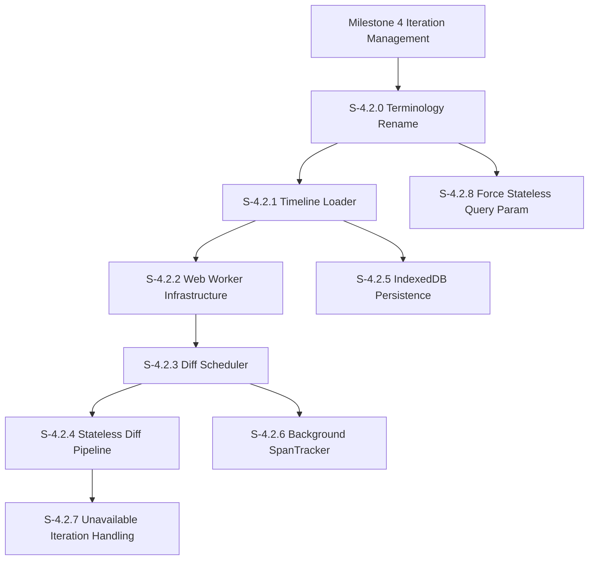

# Milestone 4.2: Stateless Iteration Management

**Goal**: Upgrade Stateless Mode (formerly "Degraded Mode") to achieve near-parity with Stateful Mode (formerly "Iteration Mode") without requiring the GitHub Action. Enable iteration tracking, cross-iteration diffs, and comment persistence using only GitHub's native APIs.

**Horizontal Requirements**:
- **Test Coverage**: 70% coverage. Web Worker and scheduler logic requires comprehensive unit tests.
- **Performance**: Diff computation must not block UI. All heavy computation runs in Web Workers.
- **Accessibility**: Loading states must be announced to screen readers. Unavailable iterations clearly indicated.

## Architecture & Scaffolding
*Implementation must follow `AGENTS.md` (root). Focus on `features/iterations`, `features/diff/workers`, and `features/diff/scheduler`.*

See [spec/functional/iterations.md](../functional/iterations.md) for the full iteration model and stateless mode architecture.

## Dependency Graph

---

## [S-4.2.0] Story 4.2.0: Terminology Rename

As a developer, I want consistent terminology so that "stateless" and "stateful" clearly describe the modes based on whether server-side state (GitHub Action artifact) is required.

### Description
Rename "degraded mode" to "stateless mode" and "iteration mode" to "stateful mode" throughout the codebase. Remove the degraded mode banner since stateless mode is now a first-class feature. Update store state, types, and UI text.

### Acceptance Criteria
1. **Code Renaming**:
   - [ ] [AC-4.2.0.1] Rename `isDegraded` state field to `mode: 'stateful' | 'stateless'`.
   - [ ] [AC-4.2.0.2] Rename `degradedReason` to `statelessReason` (for debugging).
   - [ ] [AC-4.2.0.3] Update all type definitions and interfaces.
   - [ ] [AC-4.2.0.4] Update function names (e.g., `enterDegradedMode` → `enterStatelessMode`).
2. **UI Changes**:
   - [ ] [AC-4.2.0.5] Remove `DegradedModeBanner` component entirely.
   - [ ] [AC-4.2.0.6] Update any user-facing text from "degraded" to "stateless".
   - [ ] [AC-4.2.0.7] Iteration selector works identically in both modes (no visual distinction).
3. **Test Updates**:
   - [ ] [AC-4.2.0.8] Rename E2E test directories: `degraded-mode` → `stateless-mode`, `iteration-mode` → `stateful-mode`.
   - [ ] [AC-4.2.0.9] Update test assertions and fixtures.

---

## [S-4.2.1] Story 4.2.1: Timeline Loader

As a user viewing a PR without the CodjiFlo workflow, I want the app to detect iterations from the PR timeline so that I can compare changes across force-pushes.

### Description
Implement a timeline loader that uses GitHub's Issues Timeline API to detect `head_ref_force_pushed` events and build an iteration list. Combine with PR Commits endpoint for complete commit history. Each force-push creates a new iteration with preserved before/after SHAs.

### Acceptance Criteria
1. **API Integration**:
   - [ ] [AC-4.2.1.1] Fetch PR timeline via `GET /repos/{owner}/{repo}/issues/{pr_number}/timeline`.
   - [ ] [AC-4.2.1.2] Fetch PR commits via `GET /repos/{owner}/{repo}/pulls/{pr_number}/commits`.
   - [ ] [AC-4.2.1.3] Fetch PR data for base SHA and metadata.
2. **Force-Push Detection**:
   - [ ] [AC-4.2.1.4] Extract `head_ref_force_pushed` events from timeline.
   - [ ] [AC-4.2.1.5] Capture `before` SHA (pre-force-push) and `after` SHA (post-force-push).
   - [ ] [AC-4.2.1.6] Build iteration list with sequential revision numbers.
3. **Iteration Building**:
   - [ ] [AC-4.2.1.7] Initial iteration: PR's first commit state when opened.
   - [ ] [AC-4.2.1.8] Subsequent iterations: Each force-push creates new iteration.
   - [ ] [AC-4.2.1.9] Regular pushes (non-force) do not create new iterations (same iteration, more commits).
4. **Data Model**:
   - [ ] [AC-4.2.1.10] `StatelessIteration` interface with: revision, headSha, baseSha, beforeSha, author, createdAt, eventType.
   - [ ] [AC-4.2.1.11] Iterations sorted chronologically by creation time.

---

## [S-4.2.2] Story 4.2.2: Web Worker Infrastructure

As a developer, I want diff computation to run in a Web Worker so that the UI remains responsive during heavy computation.

### Description
Create a Web Worker for diff computation using Comlink for type-safe RPC. The worker handles fetching file content, computing line/word diffs, and computing SpanTrackers. Support task cancellation for responsive priority changes.

### Acceptance Criteria
1. **Worker Setup**:
   - [ ] [AC-4.2.2.1] Create `DiffComputeWorker` in `src/features/diff/workers/diff-compute.worker.ts`.
   - [ ] [AC-4.2.2.2] Use Comlink for TypeScript-native worker communication.
   - [ ] [AC-4.2.2.3] Worker initializes with access to diff-engine functions.
2. **Task Interface**:
   - [ ] [AC-4.2.2.4] `DiffTask` interface: taskId, priority, type, payload.
   - [ ] [AC-4.2.2.5] `DiffResult` interface: taskId, status, diffLines, alignedLines, error.
   - [ ] [AC-4.2.2.6] Task types: `compute_diff`, `compute_span_tracker`.
3. **Cancellation Support**:
   - [ ] [AC-4.2.2.7] AbortController for in-flight fetch requests.
   - [ ] [AC-4.2.2.8] `cancel(taskId)` method to abort active task.
   - [ ] [AC-4.2.2.9] Cancelled tasks return `status: 'cancelled'`.
4. **Content Fetching**:
   - [ ] [AC-4.2.2.10] Fetch file content via GitHub Contents API within worker.
   - [ ] [AC-4.2.2.11] Support both 2-dot (`base..head`) and 3-dot (`base...head`) comparisons.
   - [ ] [AC-4.2.2.12] Handle base64 decoding for file content.

---

## [S-4.2.3] Story 4.2.3: Diff Scheduler

As a user, I want diffs to compute in priority order so that the file I'm viewing loads first while other diffs compute in the background.

### Description
Implement a priority-based scheduler that queues diff tasks and processes them through the Web Worker. Support dynamic priority changes when user focus changes. Files with more comments are prioritized within the same priority level.

### Acceptance Criteria
1. **Priority Levels**:
   - [ ] [AC-4.2.3.1] `Highest` (0): Currently selected file (user clicked).
   - [ ] [AC-4.2.3.2] `High` (1): Files in user-selected iteration range.
   - [ ] [AC-4.2.3.3] `Medium` (2): Current iteration to latest.
   - [ ] [AC-4.2.3.4] `Low` (3): Other iterations (on-demand).
2. **Secondary Ordering**:
   - [ ] [AC-4.2.3.5] Within same priority, sort by comment count (descending).
   - [ ] [AC-4.2.3.6] Within same comment count, sort by UI file list order (ascending).
   - [ ] [AC-4.2.3.7] Within same UI order, FIFO (first scheduled first).
3. **Queue Operations**:
   - [ ] [AC-4.2.3.8] `schedule(task, options)`: Add task to queue with priority.
   - [ ] [AC-4.2.3.9] `prioritize(taskId)`: Bump task to Highest priority.
   - [ ] [AC-4.2.3.10] `clear()`: Cancel all tasks and clear queue (e.g., PR switch).
   - [ ] [AC-4.2.3.11] `getResult(taskId)`: Return cached result if available.
4. **Cancel on Priority Change**:
   - [ ] [AC-4.2.3.12] When task is prioritized, cancel in-progress lower-priority task.
   - [ ] [AC-4.2.3.13] Cancelled task returns to queue at original priority.
5. **Event Emission**:
   - [ ] [AC-4.2.3.14] `onComplete` callback when task finishes.
   - [ ] [AC-4.2.3.15] Results cached by taskId for instant retrieval.

---

## [S-4.2.4] Story 4.2.4: Stateless Diff Pipeline

As a user in stateless mode, I want to see diffs computed from GitHub's Compare API so that I can review code changes without the CodjiFlo workflow.

### Description
Integrate the DiffScheduler with the existing diff pipeline (`useDiffSource`). Show immediate file list from GitHub API while diffs compute asynchronously. Display loading state in diff viewer until computation completes.

### Acceptance Criteria
1. **File List (Immediate)**:
   - [ ] [AC-4.2.4.1] Show file list immediately from GitHub PR files API.
   - [ ] [AC-4.2.4.2] File stats (additions/deletions) show loading indicator until diff computed.
   - [ ] [AC-4.2.4.3] File status badge computed from GitHub API initially.
2. **Diff Viewer Loading**:
   - [ ] [AC-4.2.4.4] Show "Computing diff..." message while awaiting result.
   - [ ] [AC-4.2.4.5] Loading state announced to screen readers.
   - [ ] [AC-4.2.4.6] Smooth transition when diff becomes available.
3. **Pipeline Integration**:
   - [ ] [AC-4.2.4.7] `useDiffSource` checks scheduler for cached result.
   - [ ] [AC-4.2.4.8] If not cached, schedule task at Highest priority.
   - [ ] [AC-4.2.4.9] Subscribe to scheduler completion events.
4. **GitHub Diff APIs**:
   - [ ] [AC-4.2.4.10] Use 3-dot diff (`base...head`) for default PR comparison (merge-base).
   - [ ] [AC-4.2.4.11] Use 2-dot diff (`sha1..sha2`) for specific iteration comparisons.
   - [ ] [AC-4.2.4.12] Handle large diffs (>500 files) with pagination.

---

## [S-4.2.5] Story 4.2.5: IndexedDB Persistence

As a returning user, I want the app to remember which iteration I last viewed so that I can quickly see what changed since my last visit.

### Description
Persist minimal state to IndexedDB: last seen iteration per PR, discovered iteration SHAs (for immutability), and unavailable iterations. No diff or SpanTracker caching.

### Acceptance Criteria
1. **Database Schema**:
   - [ ] [AC-4.2.5.1] Database name: `codjiflo-stateless`.
   - [ ] [AC-4.2.5.2] Store `lastSeen`: key=prKey, value={iterationRevision, headSha, timestamp}.
   - [ ] [AC-4.2.5.3] Store `iterations`: key=prKey/revision, value={revision, headSha, baseSha, beforeSha, discoveredAt}.
   - [ ] [AC-4.2.5.4] Store `unavailable`: key=prKey/revision, value={revision, reason, detectedAt}.
2. **Last Seen Tracking**:
   - [ ] [AC-4.2.5.5] Update last seen when user views a file in an iteration.
   - [ ] [AC-4.2.5.6] On PR open, compute diff from last seen to latest if returning user.
   - [ ] [AC-4.2.5.7] First-time visitors get base→latest diff.
3. **Iteration Immutability**:
   - [ ] [AC-4.2.5.8] Store discovered iterations to preserve force-push history.
   - [ ] [AC-4.2.5.9] Merge persisted iterations with fresh timeline data on load.
   - [ ] [AC-4.2.5.10] Never overwrite existing iteration data (immutable).
4. **Storage Management**:
   - [ ] [AC-4.2.5.11] No TTL or eviction (minimal data size).
   - [ ] [AC-4.2.5.12] Handle IndexedDB unavailable gracefully (private browsing).

---

## [S-4.2.6] Story 4.2.6: Background SpanTracker Precomputation

As a user, I want comment positions to be ready when I navigate to a file so that I don't see loading states for comments.

### Description
After initial PR load, precompute SpanTrackers for all files that have comments. Run in background worker at low priority. Use the same algorithm as the GitHub Action but computed at runtime.

### Acceptance Criteria
1. **Trigger**:
   - [ ] [AC-4.2.6.1] Start precomputation after initial diff for selected file completes.
   - [ ] [AC-4.2.6.2] Only compute for files with at least one comment.
   - [ ] [AC-4.2.6.3] Run at `Low` priority (below user-selected files).
2. **Computation**:
   - [ ] [AC-4.2.6.4] Use same diff algorithm as GitHub Action for consistency.
   - [ ] [AC-4.2.6.5] Generate line mappings (left line → right line).
   - [ ] [AC-4.2.6.6] Support unchanged, added, deleted mapping types.
3. **Caching**:
   - [ ] [AC-4.2.6.7] Cache computed SpanTrackers in memory by (filePath, leftSha, rightSha).
   - [ ] [AC-4.2.6.8] No IndexedDB persistence (recompute on each session).
   - [ ] [AC-4.2.6.9] Clear cache when iteration range changes.
4. **Comment Position Mapping**:
   - [ ] [AC-4.2.6.10] Map comment positions forward through iterations.
   - [ ] [AC-4.2.6.11] Map comment positions backward for historical view.
   - [ ] [AC-4.2.6.12] Handle orphaned comments (deleted code) gracefully.

---

## [S-4.2.7] Story 4.2.7: Unavailable Iteration Handling

As a user, I want to know when an iteration's data is no longer available so that I understand why I can't view certain comparisons.

### Description
When GitHub returns 404/410 for a commit (garbage collected), mark the iteration as unavailable. Show a badge in the iteration selector and display a helpful message directing users to Stateful Mode.

### Acceptance Criteria
1. **Detection**:
   - [ ] [AC-4.2.7.1] Detect 404 response when fetching commit content.
   - [ ] [AC-4.2.7.2] Detect 410 Gone response (explicitly deleted).
   - [ ] [AC-4.2.7.3] Mark iteration as unavailable in store.
2. **UI Indication**:
   - [ ] [AC-4.2.7.4] Show "Unavailable" badge on iteration in selector.
   - [ ] [AC-4.2.7.5] Disable selection of unavailable iterations.
   - [ ] [AC-4.2.7.6] Tooltip explains: "This iteration's commit data is no longer available on GitHub."
3. **Guidance**:
   - [ ] [AC-4.2.7.7] Include link to Stateful Mode documentation in tooltip.
   - [ ] [AC-4.2.7.8] Message: "Enable Stateful Mode to preserve iteration history."
4. **Persistence**:
   - [ ] [AC-4.2.7.9] Persist unavailable status in IndexedDB.
   - [ ] [AC-4.2.7.10] Don't retry unavailable iterations on subsequent loads.

---

## [S-4.2.8] Story 4.2.8: Force Stateless Query Param

As a developer, I want to force stateless mode via query parameter so that I can test stateless behavior on PRs that have iteration artifacts.

### Description
Add `?mode=stateless` query parameter that bypasses artifact loading and uses timeline-based iteration detection even when a CodjiFlo artifact exists. Useful for testing and comparing modes.

### Acceptance Criteria
1. **Query Param Detection**:
   - [ ] [AC-4.2.8.1] Check for `mode=stateless` in URL query params.
   - [ ] [AC-4.2.8.2] Skip artifact discovery when param is present.
   - [ ] [AC-4.2.8.3] Proceed directly to timeline loader.
2. **URL Persistence**:
   - [ ] [AC-4.2.8.4] Preserve query param during navigation.
   - [ ] [AC-4.2.8.5] Include in shareable URLs.
3. **UI Indication**:
   - [ ] [AC-4.2.8.6] (Optional) Show subtle indicator that stateless mode is forced.
   - [ ] [AC-4.2.8.7] No impact on iteration selector behavior.
4. **Testing Support**:
   - [ ] [AC-4.2.8.8] E2E tests can use param to test stateless mode on any PR.
   - [ ] [AC-4.2.8.9] Document param in developer docs.
